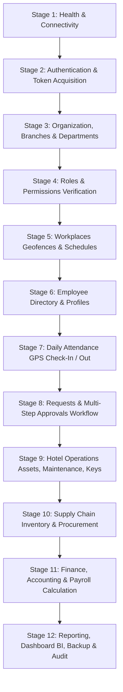

# CyberWise Hotel ERP — API Testing Guide & Automation Playbook

## 1. Executive Summary & Objective

This guide serves as the definitive manual for testing, verifying, and certifying the **CyberWise Hotel ERP & Workforce Management Backend**. It covers all **416 HTTP endpoints across 48 modules**, enforcing strict authentication, RBAC authorization, schema validation, and transactional integrity.

---

## 2. Environment Setup & Prerequisites

### 2.1 Infrastructure Prerequisites
Ensure PostgreSQL and Redis containers are running:
```bash
# In backend directory
docker-compose up -d postgres redis
```

Verify database migration and canonical seed state:
```bash
npm run prisma:generate
npm run prisma:migrate
npm run prisma:seed
```

### 2.2 Test Accounts & Personas
The canonical database seed (`prisma/seed.ts`) provisions authoritative accounts:
| Role | Email | Password | Allowed Capabilities |
|------|-------|----------|----------------------|
| **SUPER_ADMIN** | `admin@example.test` | `Test@123456` | Full authoritative access across all 48 modules |
| **HR_MANAGER** | `hr@example.test` | `Test@123456` | Workforce, leaves, payroll, employees, approvals |
| **EMPLOYEE** | `employee.active@example.test` | `Test@123456` | Self-service attendance, requests, profile, chat |
| **SUSPENDED** | `employee.suspended@example.test` | `Test@123456` | Blocked from authenticated endpoints (401/403) |

---

## 3. Chained Execution Order & Dependency Map

To execute a complete end-to-end integration test without missing relational foreign keys, follow this **12-Stage Dependency Sequence**:



### Stage Breakdown
1. **Stage 1: Health & System Diagnostics** (`HLT-001` to `HLT-008`)
   - Verify PostgreSQL connection (`/health/db`) and Redis latency (`/health/redis`).
2. **Stage 2: Authentication Flow** (`AUTH-001` to `AUTH-006`)
   - Login with `admin@example.test` -> capture `accessToken` and `refreshToken`.
   - Verify `/auth/me` reflects complete user profile and roles.
   - Test token refresh with `/auth/refresh`.
3. **Stage 3: Corporate Hierarchy** (`ORG-001` to `ORG-027`)
   - Confirm default organization (`CW-CORP`), headquarters branch (`GNH-HQ`), and core departments.
4. **Stage 4: RBAC Security Matrix** (`ROLE-001` to `ROLE-008`, `PERM-001` to `PERM-004`)
   - Query system roles and verify permission assignments.
5. **Stage 5: Workplaces & Shifts** (`WKP-001` to `WKP-005`, `SCH-001` to `SCH-005`)
   - Configure workplace GPS coordinates (Latitude: 30.0444, Longitude: 31.2357, Radius: 100m).
   - Set standard shift (09:00 - 17:00, 15 min grace period).
6. **Stage 6: Employee Lifecycle** (`EMP-001` to `EMP-009`, `HR-001` to `HR-008`)
   - Query directory, view employee profile, upload required verification documents.
7. **Stage 7: Attendance Operations** (`ATT-001` to `ATT-010`)
   - Simulate employee check-in inside geofence with valid timestamp.
   - Query live status (`/attendance/live`) and attendance log history.
8. **Stage 8: Requests & Approvals** (`REQ-001` to `REQ-015`, `APR-001` to `APR-006`)
   - Employee submits leave request (`ANNUAL_LEAVE`).
   - HR Manager reviews pending approval queue and executes approval action.
9. **Stage 9: Hotel Operations & Asset Management** (`AST-001` to `AST-008`, `MNT-001` to `MNT-011`, `KEY-001` to `KEY-006`)
   - Register asset, trigger depreciation calculation, log maintenance work order, issue room keys.
10. **Stage 10: Supply Chain & Procurement** (`INV-001` to `INV-012`, `PRC-001` to `PRC-015`)
    - Register supplier, create purchase order, adjust warehouse inventory stock.
11. **Stage 11: Finance, Invoicing & Payroll** (`FIN-001` to `FIN-013`, `PAY-001` to `PAY-024`)
    - Create general ledger entry, generate payroll period, calculate employee payslips, request advance.
12. **Stage 12: Reporting, Dashboard, Backup & Audit** (`REP-001` to `REP-018`, `DSH-001`, `BKP-001` to `BKP-006`, `AUD-001`)
    - Fetch executive KPI dashboard, generate attendance report, execute multi-domain backup drill.

---

## 4. Role-Based Access Control (RBAC) Test Matrix

| Subsystem | Super Admin | HR Admin / Manager | Supervisor | Employee | Suspended |
|-----------|-------------|--------------------|------------|----------|-----------|
| **System Settings** (`/settings`) | **200 OK** | 403 Forbidden | 403 Forbidden | 403 Forbidden | 401 Unauthorized |
| **Backup Drills** (`/backup`) | **200 OK** | 403 Forbidden | 403 Forbidden | 403 Forbidden | 401 Unauthorized |
| **Employee Directory Read** (`/employees`) | **200 OK** | **200 OK** | **200 OK** | **200 OK** | 401 Unauthorized |
| **Employee Creation** (`/employees`) | **201 Created** | **201 Created** | 403 Forbidden | 403 Forbidden | 401 Unauthorized |
| **Attendance Check-In** (`/attendance/check-in`) | **200 OK** | **200 OK** | **200 OK** | **200 OK** | 401 Unauthorized |
| **Payroll Calculation** (`/payroll/calculate`) | **200 OK** | **200 OK** | 403 Forbidden | 403 Forbidden | 401 Unauthorized |
| **Own Leave Request** (`/requests`) | **201 Created** | **201 Created** | **201 Created** | **201 Created** | 401 Unauthorized |
| **Approve Others' Requests** (`/approvals`) | **200 OK** | **200 OK** | **200 OK** | 403 Forbidden | 401 Unauthorized |

---

## 5. Negative & Boundary Testing Scenarios

### 5.1 Authentication Failures
- **Expired Token**: Send expired JWT -> Expect `401 Unauthorized`.
- **Malformed Token**: Send `Authorization: Bearer invalid-garbage` -> Expect `401 Unauthorized`.
- **Wrong Password**: Submit `admin@example.test` with incorrect password -> Expect `401 Unauthorized`.

### 5.2 Validation & Payload Errors (400 Bad Request)
- **Extra Fields**: Submit payload with non-whitelisted keys -> Rejected by Fastify ValidationPipe (`forbidNonWhitelisted: true`).
- **Missing Required Fields**: Submit `POST /api/v1/auth/login` with empty object `{}` -> Returns detailed `400 Bad Request` listing missing `email` and `password`.
- **Invalid Email Format**: Send `email: "not-an-email"` -> Returns `400 Bad Request`.

### 5.3 Business Logic & Entity Constraints
- **Geofence Check-In Violation**: Submit GPS check-in with coordinates far outside branch geofence (e.g. Lat: 0, Lng: 0) -> Returns rejection event `CHECK_IN_REJECTED`.
- **Duplicate Resource**: Create organization or branch with existing `code` -> Expect `409 Conflict` or database unique constraint error.
- **Resource Not Found**: Request `GET /api/v1/employees/00000000-0000-0000-0000-000000000000` -> Returns `404 Not Found`.

---

## 6. Automated Execution with Newman CLI

Run the entire test suite automatically in CI/CD pipelines:

```bash
# Install Newman if not present
npm install -g newman

# Run the complete test suite against local environment
newman run CyberWise_Hotel_ERP.postman_collection.json \
  -e CyberWise_Hotel_ERP.postman_environment.json \
  --reporters cli,json \
  --reporter-json-export newman-results.json
```
