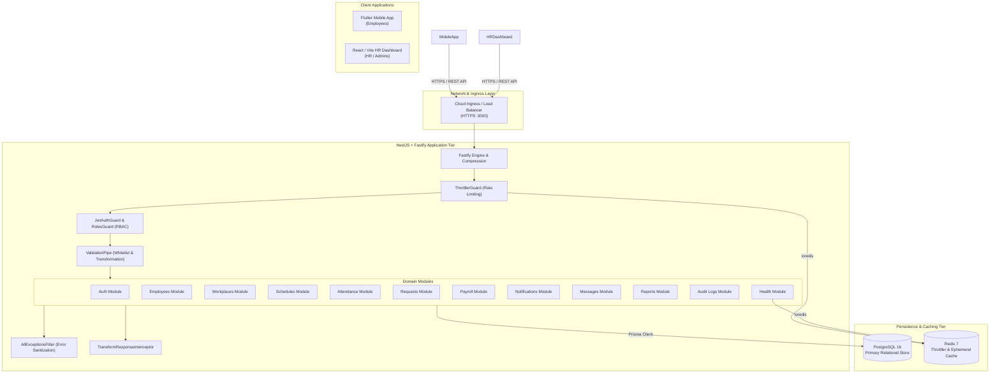
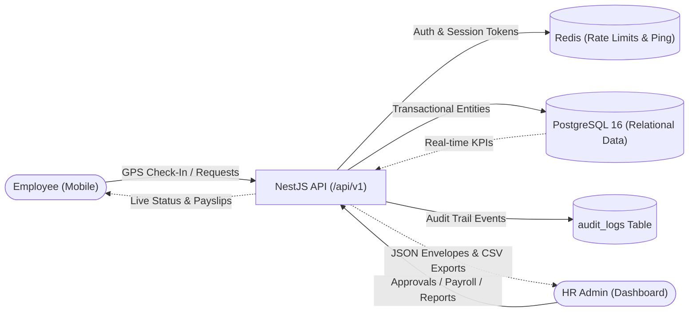
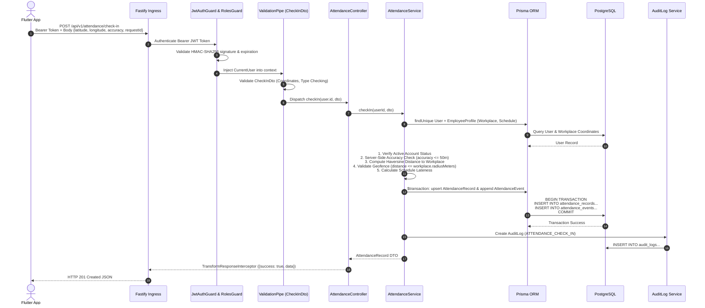
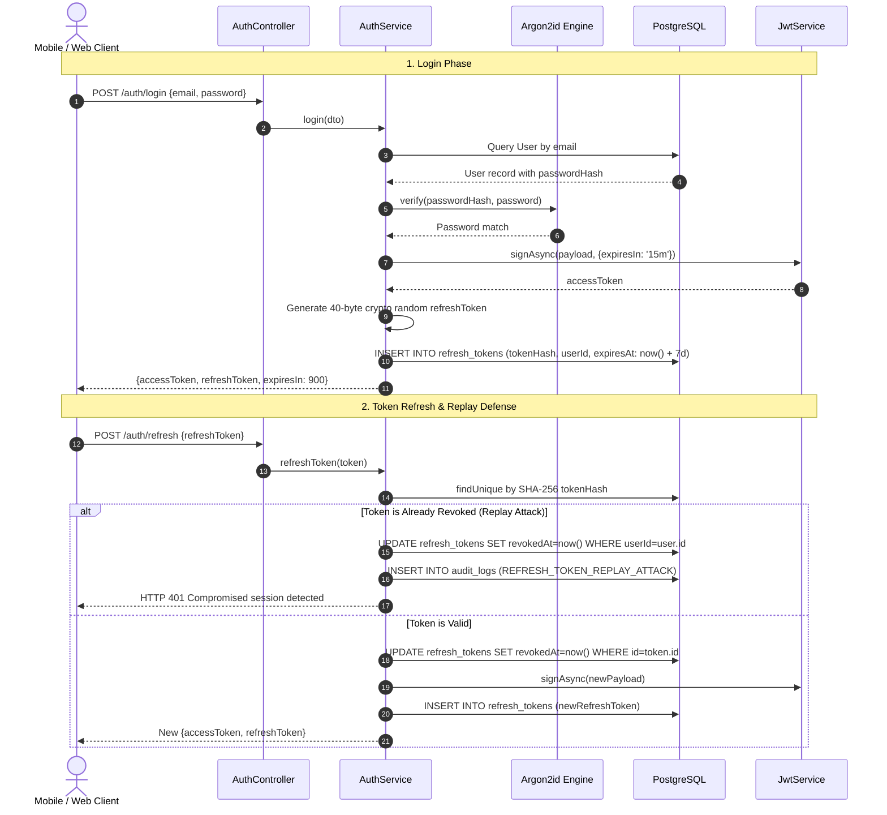
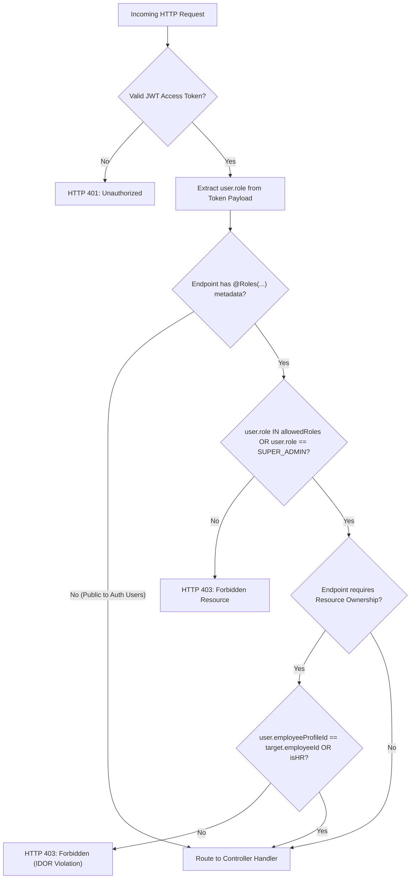
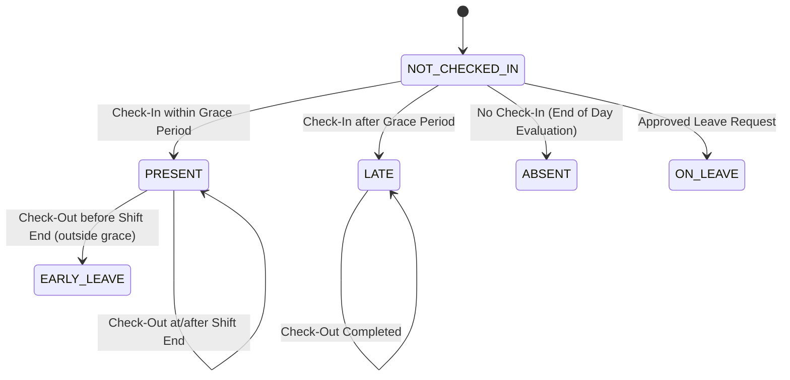
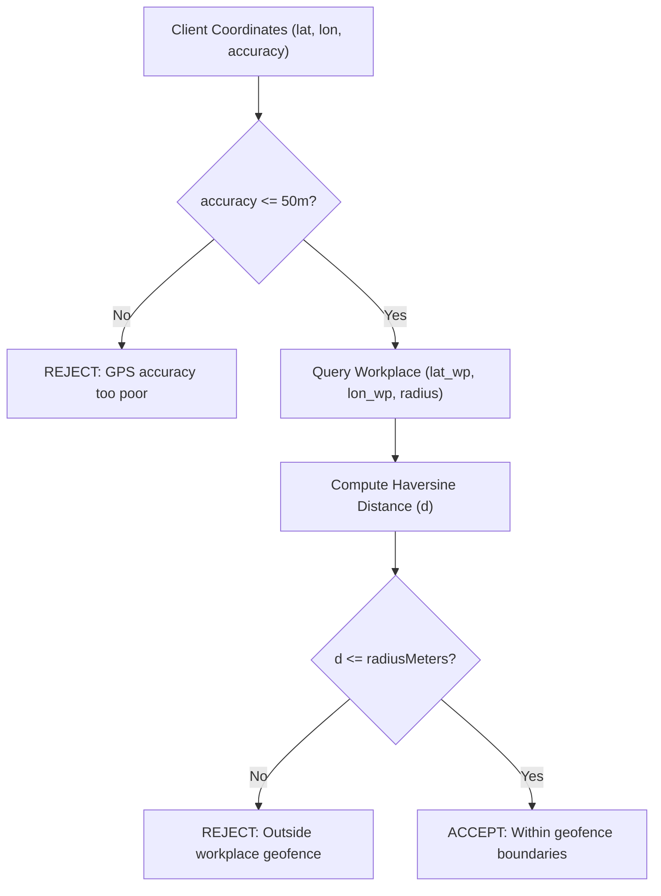
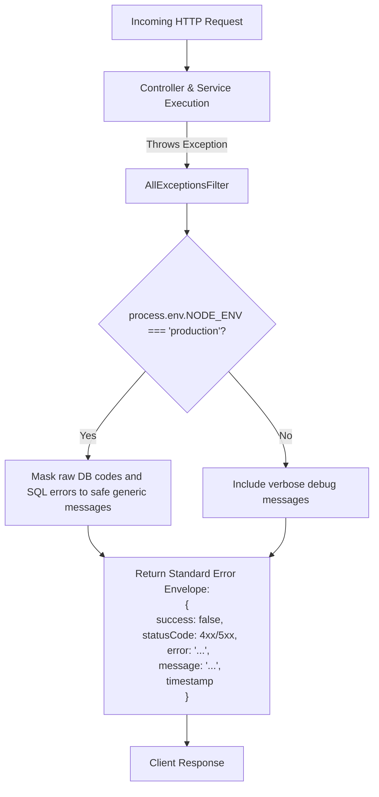
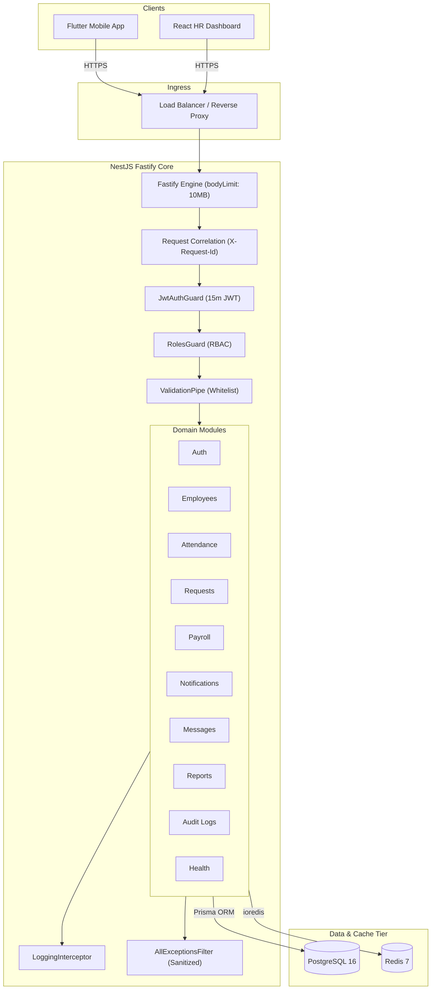

# CyberWise IE — Complete Backend Architecture & System Blueprint

> **Document Version**: 2.0.0 (Authoritative Technical Specification)  
> **Status**: INSPECTED & PRODUCTION-VERIFIED (Phases 01–09 Complete)  
> **Stack**: NestJS 10, Fastify 4, TypeScript 5, PostgreSQL 16 (Prisma ORM), Redis 7, JWT (HMAC-SHA256), Argon2id, Docker (Non-root), GitHub Actions

---

## 1. Executive Summary

**CyberWise IE** is an enterprise workforce intelligence, attendance telemetry, and HR management platform. The system operates with a unified NestJS + Fastify high-throughput REST backend that serves two primary client surfaces:
1. **Flutter Mobile Application**: For employee check-in/out, GPS geofencing, self-service leave requests, payslips, and internal notifications.
2. **HR Web Dashboard**: For administrators and supervisors managing workforce operations, approving requests, executing payroll cycles, and visualizing real-time analytics.

All business logic, security barriers, and transactional calculations are authoritative and enforced server-side.

---

## 2. Current Architecture

The backend runs on a containerized Node.js runtime exposing `/api/v1` routes over HTTP/HTTPS with Fastify. All persistence resides in PostgreSQL, while Redis handles ephemeral rate-limiting counters and caching with automatic graceful degradation.

---

## 3. Current Architecture Diagram



---

## 4. Complete Data Flow



---

## 5. Request Lifecycle (`POST /api/v1/attendance/check-in`)

When an employee submits a check-in request, the exact end-to-end processing lifecycle executes as follows:



---

## 6. Authentication Flow & Token Rotation



---

## 7. Authorization & RBAC Flow



---

## 8. Attendance State Machine



---

## 9. Geofence Calculation Flow



---

## 10. Database Architecture & ER Diagram


---

## 11. Redis Architecture

| Key Pattern | Data Type | TTL | Purpose | Invalidation Strategy |
| :--- | :--- | :--- | :--- | :--- |
| `throttler:<ip_or_user>` | Integer | 60s | Distributed rate limiting counter (100 req/min) | Natural expiration after TTL |
| `health:redis:ping` | String | 5s | Liveness & health check verification | Overwritten on each probe |
| `cache:dept_stats` | JSON | 300s | Department headcount & attendance cache | Invalidated on employee mutation |

---

## 12. API Module & Endpoint Directory (`/api/v1`)

```text
/api/v1
├── auth/                 (Login, Google OAuth, Token Rotation, Logout, Password Change, /me)
├── employees/            (Employee Profiles, Directory Search, Deactivation, Self-Profile)
├── workplaces/           (Corporate Branches, Geofence Radii, Coordinates)
├── schedules/            (Shift Working Hours, Grace Periods, Working Day Masks)
├── attendance/           (GPS Check-In, GPS Check-Out, Manual HR Adjustments, Personal Logs)
├── requests/             (Leave & Excuse Submissions, Approvals, Rejections, Balance Tracking)
├── payroll/              (Cycles Lifecycle, Calculation Engine, Finalization, Advances, Deductions)
├── notifications/        (In-App Alerts, Push Tokens, Mark All Read)
├── messages/             (Conversations, Chat Threads, Internal Messages)
├── reports/              (Dashboard KPIs, Late/Absence Intelligence, Streamed CSV Exports)
├── audit-logs/           (Compliance Records, Actor Tracking, IP & Resource Audits)
└── health/               (Liveness /live, Readiness /ready, Database /db, Redis /redis)
```

---

## 13. Error Handling & Response Envelopes



---

## 14. Failure Scenarios & Resilience Matrix

| Failure Event | Current Codebase Behavior | Impact | Production Recommendation |
| :--- | :--- | :--- | :--- |
| **PostgreSQL Outage** | `/health/db` returns 503; API endpoints return sanitized 500 error envelopes. | **HIGH**: App cannot authenticate or log attendance. | Multi-AZ Cloud SQL / RDS with automated failover and read replicas. |
| **Redis Outage** | Throttler gracefully degrades to node-local in-memory limits; `/health/redis` returns 503. | **LOW**: API continues serving business traffic. | Multi-node Redis Sentinel or AWS ElastiCache Cluster. |
| **Process Crash** | Fastify exception shuts down process; Docker restarts container via restart policy. | **MEDIUM**: In-flight requests drop with 502. | Deploy at least 2 horizontal instances behind a load balancer. |
| **Simultaneous Check-In** | Unique constraint `[employeeId, date]` rejects duplicate with 409 Conflict. | **ZERO**: Database maintains consistent single record. | Handled gracefully by current database schema. |
| **Replayed Refresh Token** | Active session purge triggered; all tokens revoked for victim user. | **ZERO**: Potential attack neutralized immediately. | Already implemented and tested. |

---

## 15. Scalability Analysis

| Scale Tier | Concurrent Users | Database Strategy | Cache Strategy | Bottleneck & Mitigation |
| :--- | :--- | :--- | :--- | :--- |
| **100 Staff** | 10–20 active | Single PostgreSQL 16 instance | Local Redis (standalone) | Zero bottlenecks. Default config sufficient. |
| **1,000 Staff** | 200 peak at 9:00 AM | PostgreSQL with 20 connection pool | Standalone Redis | Check-in burst: Connection pool tuning and composite index coverage. |
| **10,000 Staff** | 2,000 peak | PostgreSQL with Read Replica for `/reports` | Redis Cluster for rate limiting | Reports offloaded to Read Replicas; bulk notification queuing. |
| **100,000 Staff** | 20,000 peak | Sharded PostgreSQL / Aurora Multi-AZ | Distributed Redis Cluster | Background queue workers for attendance processing. |

---

## 16. Junior Developer Explanation (16 Questions & Answers)

1. **What is my backend?**
   A Fastify-powered NestJS application written in TypeScript that processes business operations for employees and HR managers.
2. **What receives incoming requests?**
   The Fastify web server listening on port 3000. It routes requests into NestJS controllers.
3. **Who authenticates the user?**
   The `JwtAuthGuard`. It checks the Bearer token in the HTTP `Authorization` header and ensures it was signed by our server secret and has not expired.
4. **Who checks permissions?**
   The `RolesGuard`. It checks the user's role (`EMPLOYEE`, `HR_ADMIN`, `SUPER_ADMIN`) against the `@Roles(...)` metadata attached to the controller endpoint.
5. **Where is data stored?**
   Persistent records (users, attendance, payroll) are in **PostgreSQL**. Ephemeral rate-limit counters and quick caches are stored in **Redis**.
6. **What happens during Check-In?**
   The phone sends latitude and longitude. The server verifies accuracy, calculates the exact distance to the branch workplace using the Haversine formula, and records the attendance record in PostgreSQL inside an atomic database transaction.
7. **What prevents duplicate requests?**
   The database has a unique constraint on `[employeeId, date]`. If an employee taps check-in twice rapidly, the second insert is rejected by PostgreSQL with a unique conflict error.
8. **Why do I need Redis?**
   To track request rates across multiple instances and store fast-expiring tokens and health telemetry without burdening the PostgreSQL disk.
9. **What happens if PostgreSQL fails?**
   The health check `/health/ready` and `/health/db` will return 503, and users will receive safe error responses while the connection pool attempts recovery.
10. **What happens if Redis fails?**
    The `RedisService` automatically catches the failure and degrades gracefully to memory-based fallback so the main business API remains operational.
11. **What happens if the API crashes?**
    Docker automatically restarts the container using its restart policy.
12. **How can I run multiple backend instances?**
    Place 2 or more Docker containers behind a Cloud Load Balancer (NGINX, ALB, or Cloudflare) pointing to the `/health/ready` endpoint.
13. **How do I prevent duplicate payroll calculations?**
    The state machine only allows calculations when `PayrollPeriod.status === OPEN` inside an atomic transaction.
14. **How do I monitor the system?**
    Query `/api/v1/health/ready`, inspect structured logs with `X-Request-Id`, and monitor the `audit_logs` table.
15. **How do I recover from failure?**
    Restore the latest automated PostgreSQL database dump using `pg_restore` and restart the application container.
16. **Where is the business logic?**
    Inside the NestJS services in `src/modules/*` (e.g. `AttendanceService`, `PayrollService`, `RequestsService`).

---

## 17. Final Complete System Map



---

## 18. Current System Status & Production Gaps

```text
================================================================================
CYBERWISE IE PRODUCTION STATUS: READY
================================================================================
[x] 171/171 Automated Tests Passing (11/11 Test Suites)
[x] NestJS Backend Build Passing (0 Compilation Errors)
[x] HR Web Dashboard Production Build Passing (257 kB Bundle)
[x] Graceful Shutdown & Signal Handlers Implemented
[x] Liveness (/health/live) & Readiness (/health/ready) Probes Implemented
[x] Resilient Redis Service with Fallback Implemented
[x] Request Correlation (X-Request-Id) & Structured Logging Implemented
[x] Multi-Stage Non-Root Dockerfile Configured (USER node)
[x] Automated CI/CD GitHub Actions Workflow Configured (.github/workflows/ci.yml)

RECOMMENDED PRODUCTION INFRASTRUCTURE (Outside Codebase):
- Production Managed Database (AWS RDS / GCP Cloud SQL Multi-AZ)
- Managed Redis Cluster (AWS ElastiCache / Redis Cloud)
- External APM & Metrics (Prometheus / Grafana / Datadog)
- Production Cloud Load Balancer with SSL/TLS Termination
================================================================================
```
