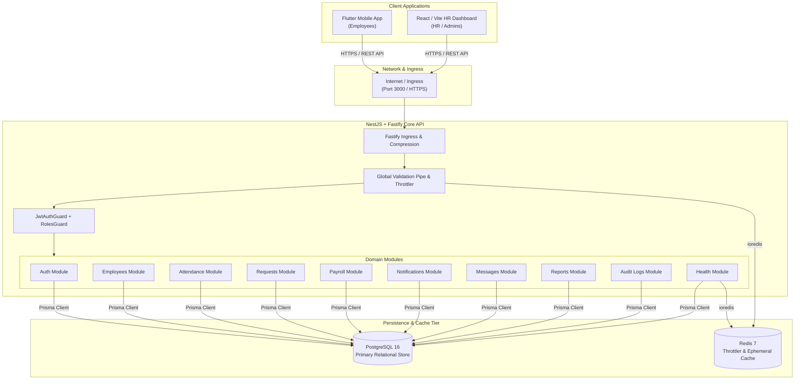
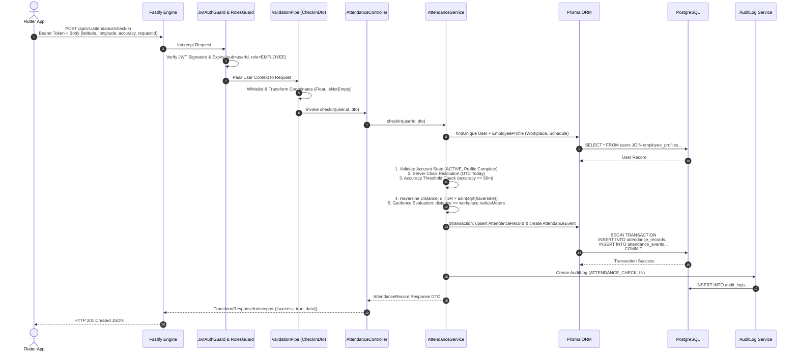
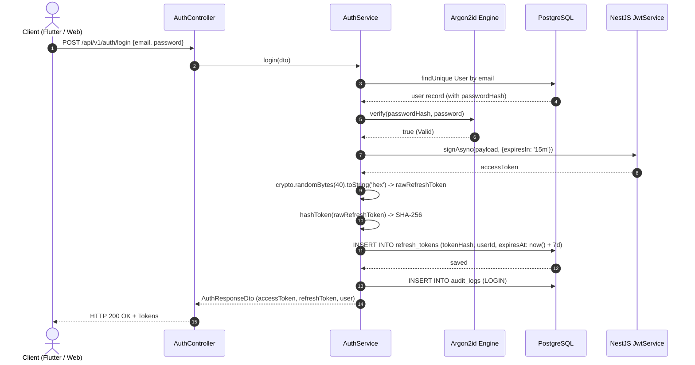
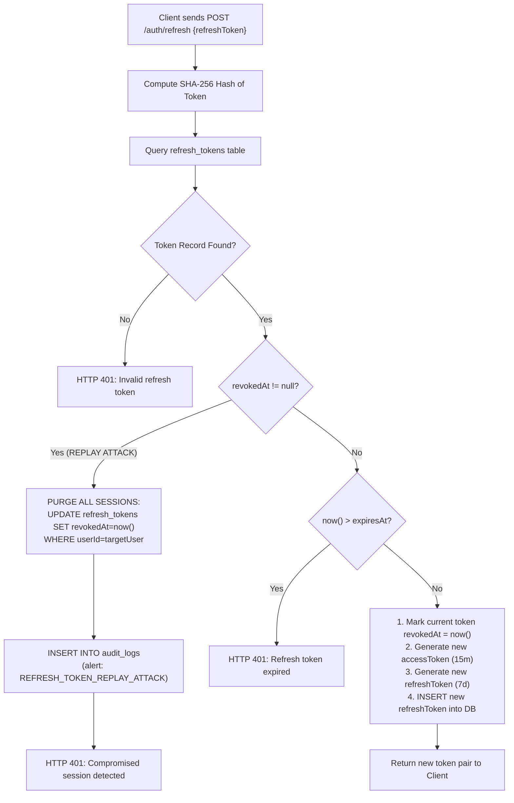
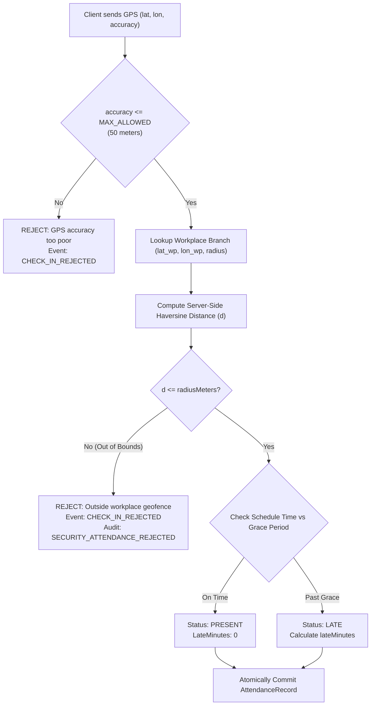
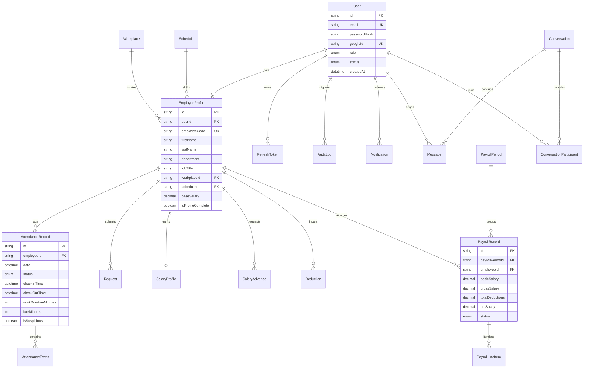

# CyberWise IE — Complete Backend System Architecture & Technical Specification

> **Document Version**: 1.0.0 (Production Verified)  
> **Status**: AUTHORITATIVE & INSPECTED (Phases 01–09 Complete)  
> **Stack**: NestJS 10, Fastify 4, TypeScript 5, PostgreSQL 16 (Prisma ORM), Redis 7, JWT (HMAC-SHA256), Argon2id

---

## 1. Executive Summary
**CyberWise IE** is an enterprise workforce intelligence, attendance telemetry, and HR management platform. The system operates with a unified NestJS + Fastify high-throughput REST backend that serves two primary clients:
1. **Flutter Mobile Application**: For employee check-in/out, GPS geofencing, self-service leave requests, payslips, and internal notifications.
2. **HR Web Dashboard**: For administrators and supervisors managing workforce operations, approving requests, executing payroll cycles, and visualizing real-time analytics.

---

## 2. Current Architecture Overview
The backend runs on a single containerized Node.js runtime exposing `/api/v1` routes over HTTP/HTTPS with Fastify. All persistence resides in PostgreSQL, while Redis handles ephemeral rate-limiting counters and caching.



---

## 3. Request Lifecycle (`POST /api/v1/attendance/check-in`)

When an employee taps **Check In** in the mobile app, the exact end-to-end processing lifecycle executes as follows:



### Detailed Execution Steps:
1. **Ingress & Transport**: Mobile app dispatches HTTPS `POST /api/v1/attendance/check-in` with `Authorization: Bearer <jwt>`.
2. **Fastify Framework Parsing**: Fastify validates content-type and parses the JSON body.
3. **Throttler Guard**: Checks Redis key `throttler:<ip_or_user>` to ensure request volume is within rate limits.
4. **JWT Authentication Guard**: Validates HMAC-SHA256 signature using `JWT_ACCESS_SECRET`. Decodes `sub` (userId), `role`, and `employeeProfileId`.
5. **Roles Guard**: Checks `@Roles(Role.EMPLOYEE, ...)` to ensure caller is permitted to access the attendance endpoint.
6. **Validation Pipe**: Enforces `CheckInDto` schema rules (`IsLatitude`, `IsLongitude`, `IsNumber`, `IsNotEmpty`). Strips untrusted properties.
7. **Controller Routing**: Invokes `AttendanceController.checkIn(@CurrentUser() user, @Body() dto)`.
8. **Service Business Validation**:
   - Fetches employee profile, workplace geofence parameters, and assigned shift schedule.
   - Rejects inactive or suspended accounts (`403 Forbidden`).
   - Verifies GPS accuracy is within bounds ($\le 50$ meters).
   - Rejects duplicate active check-ins for the current shift date.
9. **Server-Side Geofence Math**:
   $$\text{distance} = 2 R \arcsin\left(\sqrt{\sin^2\left(\frac{\Delta\text{lat}}{2}\right) + \cos(\text{lat}_1)\cos(\text{lat}_2)\sin^2\left(\frac{\Delta\text{lon}}{2}\right)}\right)$$
   Evaluates whether $\text{distance} \le \text{workplace.radiusMeters}$.
10. **Database Transaction**: Atomically creates the `AttendanceRecord` and appends an immutable `AttendanceEvent` (`CHECK_IN_ACCEPTED`).
11. **Audit Logging**: Asynchronously logs `AuditAction.ATTENDANCE_CHECK_IN`.
12. **Envelope Interceptor**: Formats response as `{ success: true, statusCode: 201, data: {...}, timestamp }`.

---

## 4. Authentication & JWT Token Flow



### Token Rotation & Replay Attack Defense



---

## 5. Geofence Verification Flow



---

## 6. Database ER Diagram (Authoritative Prisma Models)



---

## 7. Redis Architecture

| Key Pattern | Data Type | TTL | Purpose | Invalidation Strategy |
| :--- | :--- | :--- | :--- | :--- |
| `throttler:<ip_or_user>` | Integer | 60s | Rate limiting counter (100 req/min) | Natural expiration after TTL |
| `health:redis:ping` | String | 5s | Liveness & health check verification | Overwritten on each health check probe |
| `cache:dept_stats` | JSON | 300s | Department headcount & attendance cache | Invalidated on employee create/delete |

---

## 8. API Module & Endpoint Map (`/api/v1`)

```
/api/v1
├── auth/
│   ├── POST /login                 (Public - Authenticate credentials)
│   ├── POST /google                (Public - Google ID Token OAuth)
│   ├── POST /refresh               (Public - Rotate refresh token)
│   ├── POST /logout                (Authenticated - Revoke session)
│   ├── POST /change-password       (Authenticated - Update password)
│   └── GET  /me                    (Authenticated - Get current user profile)
├── employees/
│   ├── GET    /                    (HR_ADMIN, HR_MANAGER - Directory search)
│   ├── POST   /                    (HR_ADMIN - Create employee profile)
│   ├── GET    /:id                 (HR, Supervisor - Employee details)
│   ├── PATCH  /:id                 (HR_ADMIN - Update employee profile)
│   ├── DELETE /:id                 (SUPER_ADMIN - Deactivate employee)
│   └── GET    /me/profile          (EMPLOYEE - Self profile lookup)
├── workplaces/
│   ├── GET    /                    (Authenticated - List branch geofences)
│   ├── POST   /                    (HR_ADMIN, SUPER_ADMIN - Create branch)
│   └── PATCH  /:id                 (HR_ADMIN - Update geofence radius)
├── schedules/
│   ├── GET    /                    (Authenticated - List shift schedules)
│   └── POST   /                    (HR_ADMIN - Create shift schedule)
├── attendance/
│   ├── POST   /check-in            (EMPLOYEE - GPS Check-In)
│   ├── POST   /check-out           (EMPLOYEE - GPS Check-Out)
│   ├── POST   /manual              (HR_ADMIN - Manual attendance entry)
│   └── GET    /my                  (EMPLOYEE - Personal attendance log)
├── requests/
│   ├── GET    /                    (HR, Supervisor - Queue of requests)
│   ├── POST   /                    (EMPLOYEE - Submit leave/permission)
│   ├── POST   /:id/approve         (HR, Supervisor - Approve request)
│   └── POST   /:id/reject          (HR, Supervisor - Reject request with reason)
├── payroll/
│   ├── GET    /periods             (HR_ADMIN - List payroll cycles)
│   ├── POST   /periods             (HR_ADMIN - Create payroll cycle)
│   ├── POST   /periods/:id/calculate (HR_ADMIN - Execute calculation engine)
│   ├── POST   /periods/:id/finalize   (SUPER_ADMIN, HR_ADMIN - Lock cycle)
│   ├── GET    /advances            (HR_ADMIN, EMPLOYEE - Advance requests)
│   └── GET    /salary/me           (EMPLOYEE - View personal payslip)
├── notifications/
│   ├── GET    /                    (Authenticated - In-app notification feed)
│   ├── POST   /read-all            (Authenticated - Mark all alerts read)
│   └── POST   /device-token        (Authenticated - Register FCM token)
├── messages/
│   ├── GET    /conversations       (Authenticated - List chat threads)
│   └── POST   /conversations/:id/messages (Authenticated - Send internal message)
├── reports/
│   ├── GET    /dashboard           (HR, Supervisor - Executive KPI aggregate)
│   ├── GET    /attendance/export   (HR_ADMIN - Stream attendance CSV)
│   └── GET    /attendance/late     (HR_ADMIN - Lateness distribution)
├── audit-logs/
│   └── GET    /                    (SUPER_ADMIN, HR_ADMIN - Immutable audit trail)
└── health/
    ├── GET    /                    (Public - System liveness)
    ├── GET    /db                  (Public - PostgreSQL ping)
    └── GET    /redis               (Public - Redis ping)
```

---

## 9. Failure Scenarios & Resilience Matrix

| Failure Scenario | Current Behavior | System Impact | Production Recommendation |
| :--- | :--- | :--- | :--- |
| **PostgreSQL Outage** | `HealthController` fails `/health/db`; all DB queries throw 500 error envelopes. | **HIGH**: App cannot authenticate or persist attendance. | Implement Multi-AZ Read Replicas + automated failover via AWS Aurora / Cloud SQL. |
| **Redis Outage** | Throttler falls back to in-memory rate limiter; `/health/redis` returns 503. | **LOW**: API continues serving requests; rate limiting becomes node-local. | Deploy Redis Sentinel or AWS ElastiCache cluster with multi-node replication. |
| **API Process Crash** | Fastify uncaught exception shuts down node; Docker container restarts. | **MEDIUM**: In-flight HTTP requests drop with 502/504. | Run behind NGINX / Cloud Load Balancer with minimum 2 horizontal replicas. |
| **Simultaneous Check-In (Race Condition)** | PostgreSQL unique constraint `[employeeId, date]` aborts duplicate query with `409 Conflict`. | **ZERO**: Database maintains consistent single daily record. | Handled gracefully by current database schema constraints. |
| **Compromised Refresh Token** | Replay detection triggers, invalidates all sessions for user, and logs audit alert. | **ZERO**: Potential attack neutralized immediately. | Already implemented in Phase 09. |

---

## 10. Production Readiness & Infrastructure Status

```
================================================================================
COMPONENT STATUS CHECKLIST
================================================================================
[x] NestJS + Fastify Runtime            : IMPLEMENTED & TESTED (162/162 Tests Pass)
[x] JWT Auth & Replay Rotation          : IMPLEMENTED & TESTED
[x] RBAC & IDOR Barriers                : IMPLEMENTED & TESTED
[x] Server-Side GPS Geofencing          : IMPLEMENTED & TESTED
[x] Payroll Engine & State Machine      : IMPLEMENTED & TESTED
[x] Security Headers & Error Masking    : IMPLEMENTED
[x] Multi-Stage Non-Root Dockerfile     : IMPLEMENTED
[x] GitHub Actions CI Pipeline          : IMPLEMENTED (.github/workflows/ci.yml)
[x] React / Vite HR Dashboard           : IMPLEMENTED (257 kB Bundle)
[ ] Distributed Prometheus/Grafana      : REQUIRES INFRASTRUCTURE
[ ] Sentry Error Tracking Hook          : REQUIRES INFRASTRUCTURE / DSN
[ ] Production Cloud Load Balancer      : REQUIRES INFRASTRUCTURE
================================================================================
```

---

## 11. Junior Developer Guide (Simple Explanation)

1. **What is my backend?**
   A Fastify-powered NestJS application written in TypeScript that processes business operations for employees and HR managers.
2. **What receives incoming requests?**
   The Fastify web server listening on port 3000. It routes requests into NestJS controllers.
3. **Who authenticates the user?**
   The `JwtAuthGuard`. It checks the Bearer token in the HTTP `Authorization` header and ensures it was signed by our server secret and has not expired.
4. **Who checks permissions?**
   The `RolesGuard`. It checks the user's role (`EMPLOYEE`, `HR_ADMIN`, `SUPER_ADMIN`) against the `@Roles(...)` metadata attached to the controller endpoint.
5. **Where is data stored?**
   Persistent records (users, attendance, payroll) are in **PostgreSQL**. Ephemeral rate-limit counters and quick caches are stored in **Redis**.
6. **What happens during Check-In?**
   The phone sends latitude and longitude. The server verifies accuracy, calculates the exact distance to the branch workplace using the Haversine formula, and records the attendance record in PostgreSQL inside an atomic database transaction.
7. **What prevents duplicate requests?**
   The database has a unique constraint on `[employeeId, date]`. If an employee taps check-in twice rapidly, the second insert is rejected by PostgreSQL with a unique conflict error.
