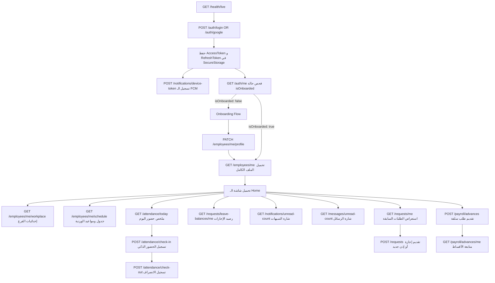
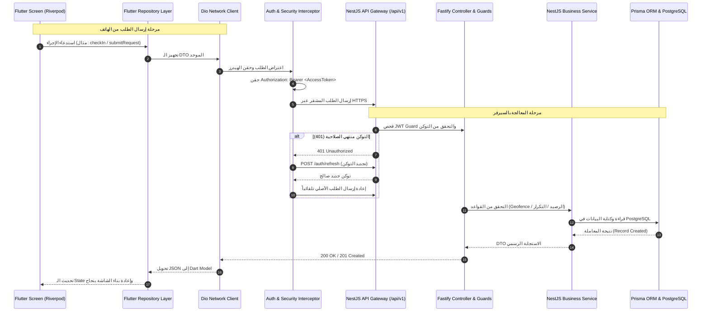

# Employee App API Integration Audit — تقرير المراجعة الشامل للربط المعماري بين تطبيق الموظفين والـ Backend

> **التاريخ:** 7 سبتمبر 2026  
> **الدور المعماري:** Senior Flutter Architect + Backend API Integration Engineer  
> **مسار مشروع Flutter:** `C:\flutter pro\Employee_jops\employee_setup`  
> **مسار عقد الـ API Contract:** `C:\flutter pro\Employee_jops\employee_setup\EMPLOYEE_APP_API_ENDPOINTS.md`  
> **طبيعة المرحلة:** تحليل ومراجعة معمارية وتدقيق شامل فقط (Zero Code Changes / Audit Only).

---

## 📑 فهرس التقرير

1. [نظرة عامة على المشروع (Project Overview)](#1-project-overview)
2. [معمارية تطبيق Flutter الفعلية (Flutter Architecture)](#2-flutter-architecture)
3. [جرد خصائص تطبيق الموظف (Employee App Features Inventory)](#3-employee-app-features)
4. [عقد واجهات برمجة التطبيقات (Backend API Contract Analysis)](#4-backend-api-contract)
5. [رحلة المستخدم الفعلية (Employee Workflow)](#5-employee-workflow)
6. [مصفوفة تغطية الـ APIs الشاملة (API Coverage Matrix)](#6-api-coverage-matrix)
7. [تدقيق المصادقة والجلسات (Authentication Audit)](#7-authentication-audit)
8. [تدقيق نظام الحضور والانصراف والبصمة (Attendance Audit)](#8-attendance-audit)
9. [تدقيق نظام الطلبات والإجازات والأذونات (Requests Audit)](#9-requests-audit)
10. [تدقيق نظام المهام وقوائم الفحص (Tasks Audit)](#10-tasks-audit)
11. [تدقيق نظام الإشعارات (Notifications Audit)](#11-notifications-audit)
12. [تدقيق نظام المحادثات والتواصل (Messaging Audit)](#12-messaging-audit)
13. [تدقيق الرواتب والسلف والجزاءات (Payroll & Advances Audit)](#13-payroll-audit)
14. [تدقيق الملف الشخصي والإعدادات (Profile & Settings Audit)](#14-profile--settings-audit)
15. [تدقيق المزامنة دون اتصال (Offline Sync Audit)](#15-offline-sync-audit)
16. [تدقيق رفع المرفقات والملفات (File Upload Audit)](#16-file-upload-audit)
17. [تدقيق نماذج البيانات والمطابقة (Model Contract Audit)](#17-model-contract-audit)
18. [تدقيق معالجة الأخطاء والشبكة (Error Handling Audit)](#18-error-handling-audit)
19. [حالات عدم التطابق التعاقدي (API Contract Mismatches)](#19-api-contract-mismatches)
20. [الـ APIs الناقصة في الباك إند (Missing Backend APIs)](#20-missing-apis)
21. [الـ APIs المتوفرة وغير المربوطة (Unconnected APIs)](#21-unconnected-apis)
22. [خصائص Flutter بدون دعم من الباك إند (Flutter Features Without Backend Support)](#22-flutter-features-without-backend-support)
23. [مخطط التبعيات التشغيلية (API Dependency Workflow)](#23-api-dependency-workflow)
24. [المخطط المعماري الكامل للربط (Complete Employee App Workflow Diagram)](#24-complete-employee-app-workflow)
25. [تصنيف الفجوات حسب الأولوية (Final Gaps & Priority Matrix)](#25-final-gaps)
26. [خطة ومراحل التنفيذ الموصى بها (Recommended Implementation Order)](#26-recommended-implementation-order)
27. [الإحصائيات والنسب النهائية (Final Statistics)](#27-final-statistics)

---

## 1. Project Overview

تطبيق الموظفين (`Employee App`) هو تطبيق موبايل موجه لموظفي الفنادق والقوى العاملة الميدانية لإدارة الخدمات الذاتية اليومية (الحضور بالبصمة الذكية والـ GPS، تقديم طلبات الإجازات والأذونات، طلبات السلف، التواصل الداخلي مع الأقسام، واستقبال التنبيهات والإشعارات).

يقابله نظام خلفي مبني على **NestJS 10 + Fastify Engine + Prisma ORM + PostgreSQL + Redis** موثق في ملف العقد التعاقدي `EMPLOYEE_APP_API_ENDPOINTS.md` بإجمالي **109 Endpoints** مخصصة لخدمات الموظف.

### النتيجة الرئيسية للتدقيق (Executive Summary)
> [!CAUTION]
> **الحقيقة الميدانية المؤكدة برمجياً:**  
> **تطبيق Flutter الحالي يعمل بنسبة 100% على بيانات وهمية محلية (`MockDatabase`, `Seeds`, `Mock Repositories`).**  
> **حزمة `dio` أو `http` غير مثبتة نهائياً داخل `pubspec.yaml`.**  
> **لا يوجد أي سطر كود واحد يرسل طلب HTTP حقيقي إلى السيرفر في أي Feature داخل التطبيق.**  
> **نسبة الربط الفعلي الحالية (Actual API Connectivity) هي: `0%` (0 من أصل 109 APIs متصلة).**

---

## 2. Flutter Architecture

تم فحص الكود المصدري داخل `employee_setup/lib` واكتشاف المعمارية التالية:

* **إدارة الحالة (State Management):** `flutter_riverpod: ^2.6.1` (مستخدمة عبر `Provider`, `NotifierProvider`, `StateNotifierProvider`, `ConsumerWidget`).
* **التوجيه والتنقل (Routing):** `go_router: ^14.8.1` (باستخدام `StatefulShellRoute.indexedStack` لإنشاء شريط التنقل السفلي الثابت مع 5 فروع رئيسية).
* **إدارة الجلسات والتخزين (Storage):**
  * `flutter_secure_storage: ^9.2.4` (مغلفة داخل `SecureSessionStorage` لتخزين التوكن وبيانات الجلسة مشفرة على Android Keystore / iOS Keychain).
  * `shared_preferences: ^2.5.2` (مستخدمة لتخزين التفضيلات غير الحساسة مثل اللغة والمظهر).
* **الموقع الجغرافي والعتاد:**
  * `geolocator: ^13.0.2` (مستخدم لجلب إحداثيات GPS الحالية وحساب المسافات).
  * `local_auth: ^2.3.0` (مستخدم للبصمة الحيوية Biometrics).
  * `flutter_local_notifications: ^18.0.1` (للإشعارات المحلية على مستوى الجهاز).
  * `connectivity_plus: ^6.1.3` (لفحص اتصال الشبكة).
  * `google_sign_in: ^6.2.2` (لمصادقة Google OAuth على الجهاز).
* **طبقة الشبكة (Network Layer):**
  * **غير موجودة (Missing):** لا يوجد `Dio`, لا يوجد `Http`, لا يوجد `Interceptors`, لا يوجد `BaseOptions`, ولا يوجد `ApiClient`.
  * الموجود حالياً في `lib/core/network`: فقط `ConnectivityService` و `MockConnectivityService`.
* **هيكل الطبقات (Clean Architecture Pattern):**
  * `lib/core/`: البنية التحتية، الموجهات، الثوابت، والتخزين.
  * `lib/features/`: مقسمة إلى ميزات مستقلة (`auth`, `home`, `attendance`, `requests`, `vacations`, `permissions`, `advances`, `communication`, `notifications`, `profile`, `settings`, `onboarding`).
  * أغلب الميزات تحتوي على `domain/models` و `presentation/screens`، بينما طبقة `data/repositories` موجهة كلياً إلى `MockDatabase` و `seeds`.

---

## 3. Employee App Features

تم حصر الخصائص المبنية فعلياً في واجهات كود Flutter (`lib/features`):

| # | الميزة في Flutter | الشاشات الرئيسية | الحالة البرمجية في Flutter |
|---|---|---|---|
| **01** | **المصادقة (Auth)** | `SplashScreen`, `LoginScreen` | مكتملة كـ UI + Google Sign-In محلي وتخزين جلسة وهمية `cyberwise_jwt_...` |
| **02** | **تهيئة الحساب (Onboarding)** | `PersonalInfoScreen`, `WorkInfoScreen`, `ReviewScreen`, `WorkLocationScreen`, `BiometricSetupScreen` | 5 شاشات تفاعلية مكتملة لتسجيل بيانات الموظف وموقعه وبصمته محلياً |
| **03** | **الرئيسية (Home Dashboard)** | `HomeScreen` | هيدر ترحيبي، بطاقة الحضور التفاعلية، أزرار الإجراءات السريعة، آخر 3 طلبات |
| **04** | **الحضور والانصراف (Attendance)** | `AttendanceScreen`, `AttendanceVerificationScreen`, `AttendanceHistoryScreen` | تسجيل الحضور/الانصراف، Geofence Check، بصمة، فحص Fake GPS و VPN، سجل الحضور، طابور أوفلاين |
| **05** | **الإجازات (Vacations)** | `VacationsListScreen`, `NewVacationScreen`, `VacationDetailsScreen` | تقديم إجازة سنوية/مرضية/عارضة/بدون راتب، استعراض، وتفاصيل |
| **06** | **الأذونات (Permissions)** | `PermissionsListScreen`, `NewPermissionScreen`, `PermissionDetailsScreen` | تقديم إذن تأخير صباحي/انصراف مبكر/غياب يوم/نصف يوم، استعراض وتفاصيل |
| **07** | **السلف المالية (Advances)** | `AdvancesListScreen`, `NewAdvanceScreen`, `AdvanceDetailsScreen`, `ExpenseReportScreen` | طلب سلفة، أقساط، تقرير تسوية العهد والمصروفات (`ExpenseReport`) |
| **08** | **مركز الطلبات الموحد (Requests Hub)** | `RequestsHubScreen` | تبويب يجمع الإجازات والأذونات والسلف في قائمة واحدة وفلترة بالحالة |
| **09** | **التواصل والمحادثات (Communication)** | `CommunicationScreen`, `DepartmentsScreen`, `DepartmentEmployeesScreen`, `EmployeeContactScreen`, `ConversationsScreen`, `ChatScreen`, `ConversationInfoScreen`, `CreateRequestScreen`, `RequestDetailsScreen`, `MyRequestsScreen` | دليل الأقسام، جهات الاتصال، محادثات 1-on-1، طلبات الأقسام الإدارية |
| **10** | **الإشعارات (Notifications)** | `NotificationsScreen`, `NotificationDetailsScreen` | قائمة الإشعارات، تمييز غير المقروء، إشعارات محلية عبر `NotificationService` |
| **11** | **الملف الشخصي (Profile)** | `ProfileScreen` | بطاقة الموظف، القسم، الفرع، الوظيفة، المدير، المستندات، جهات الطوارئ |
| **12** | **الإعدادات والدعم (Settings)** | `SettingsScreen`, `DeveloperDemoScreen`, `AboutAppScreen`, `PrivacyPolicyScreen`, `HelpCenterScreen`, `SupportScreen`, `ChatSettingsScreen` | الوضع الليلي، اللغة، البصمة، شاشة المطور لمحاكاة الـ GPS، مركز المساعدة والتذاكر |
| **13** | **تتبع الموقع (Location Tracking)** | `LocationTrackingState` | تتبع الموقع في الخلفية، وفحص الاقتراب من نطاق العمل |

---

## 4. Backend API Contract

ملف `EMPLOYEE_APP_API_ENDPOINTS.md` يحدد عقد العمل المشترك ويشمل **24 موديول** للموظف بإجمالي **109 Endpoints**:

* **Base URL:** `http://localhost:3000/api/v1` (المسار العالمي يبدأ بـ `/api/v1`).
* **معيار المصادقة:** `Authorization: Bearer <accessToken>` (صلاحية 15 دقيقة، Refresh Token صلاحية 7 أيام).
* **توزيع الموديولات:**
  1. Bootstrap & Health (2 APIs)
  2. Authentication & Security (6 APIs)
  3. Profile & Onboarding (4 APIs)
  4. Workplaces & Geofences (2 APIs)
  5. Schedules & Shifts (2 APIs)
  6. Attendance & Smart Punch (4 APIs)
  7. Requests & Leaves (5 APIs)
  8. Payroll, Advances & Payslips (7 APIs)
  9. Tasks & Checklist Management (13 APIs)
  10. Push Notifications & Alerts (8 APIs)
  11. HR Announcements (3 APIs)
  12. Internal Messaging & Chat (8 APIs)
  13. Service Requests (8 APIs)
  14. Shift Handover (5 APIs)
  15. Employee Self-Reports (1 API)
  16. Incidents & Safety (3 APIs)
  17. Maintenance Requests (3 APIs)
  18. Lost & Found (3 APIs)
  19. Employee Documents (2 APIs)
  20. Performance Goals & Reviews (4 APIs)
  21. Training & Certificates (3 APIs)
  22. Sessions & Devices (4 APIs)
  23. Offline Sync Engine (6 APIs)
  24. File Storage & Upload (2 APIs)
  + Organization Tree (1 API)

---

## 5. Employee Workflow

المخطط الزمني والتسلسلي لرحلة الموظف داخل تطبيق Flutter الحالي المستخرج من `app_router.dart` و `app_providers.dart`:

```text
[App Launch]
       │
       ▼
[SplashScreen] ──▶ فحص الجلسة عبر SecureSessionStorage
       │
       ├─────────────────────────────────────────┐
       ▼ (لا توجد جلسة نشطة)                      ▼ (توجد جلسة نشطة)
 [LoginScreen]                            فحص profileCompleted
       │                                         │
       ├─ Google Sign-In                         ├─ false ──▶ [Onboarding Flow]
       └─ Email & Password (محاكاة)               │            (Personal ➔ Work ➔ Review ➔ Location ➔ Biometric)
       │                                         │
       ▼                                         └─ true  ──▶ [MainShellScreen] (Home Tab)
[جلسة محلية مؤقتة]
       │
       ▼
[MainShellScreen] ── 5 أشرطة تنقل سفلية ثابتة:
       │
       ├── Tab 1: [HomeScreen]
       │            ├── تفاصيل الموظف ورصيد الإجازات
       │            ├── كارت الحضور (Check-In / Check-Out) ──▶ [AttendanceScreen / Verification]
       │            ├── الإجراءات السريعة (حضور، إجازات، أذونات، سلف)
       │            └── آخر 3 طلبات مقدمة
       │
       ├── Tab 2: [RequestsHubScreen]
       │            ├── قائمة موحدة لجميع الطلبات (All / Pending / Approved / Rejected)
       │            ├── قسم الإجازات ──▶ [NewVacationScreen / VacationDetailsScreen]
       │            ├── قسم الأذونات ──▶ [NewPermissionScreen / PermissionDetailsScreen]
       │            └── قسم السلف ──▶ [NewAdvanceScreen / AdvanceDetailsScreen / ExpenseReportScreen]
       │
       ├── Tab 3: [CommunicationScreen]
       │            ├── تبويب المحادثات ──▶ [ChatScreen / ConversationInfoScreen]
       │            ├── تبويب دليل الأقسام ──▶ [DepartmentsScreen ➔ DepartmentEmployeesScreen ➔ EmployeeContactScreen]
       │            └── تبويب طلبات الأقسام ──▶ [CreateRequestScreen ➔ RequestDetailsScreen ➔ MyRequestsScreen]
       │
       ├── Tab 4: [NotificationsScreen]
       │            ├── استعراض الإشعارات وتصفيتها حسب الفئة
       │            ├── تحديد كمقروء / تحديد الكل كمقروء
       │            └── تفاصيل الإشعار ──▶ [NotificationDetailsScreen]
       │
       └── Tab 5: [ProfileScreen]
                    ├── بيانات الموظف والوظيفة والفرع
                    ├── مستندات الموظف والمهارات
                    ├── إعدادات التطبيق ──▶ [SettingsScreen / Demo / About / Support / Help / Privacy]
                    └── تسجيل الخروج ──▶ مسح الجلسة والعودة إلى [LoginScreen]
```

---

## 6. API Coverage Matrix

جدول التدقيق الكامل والشامل لكل ميزات Flutter ومقارنتها مع الـ Backend API Contract:

| Feature / Screen | Flutter File / Provider | Contract API Endpoint | Method | Connected? | Status | Gap / Missing Requirement |
|---|---|---|---|---|---|---|
| **App Live Health** | `AppConfig` | `/api/v1/health/live` | `GET` | ❌ No | 🔌 UNCONNECTED | لا يوجد استدعاء لفحص جهوزية السيرفر قبل فتح التطبيق |
| **Public Settings** | `AppConfig` | `/api/v1/settings/public` | `GET` | ❌ No | 🔌 UNCONNECTED | الهوية والشعار يتم تحميلها من أصول محلية ثابتة |
| **Email Login** | `LoginScreen` | `/api/v1/auth/login` | `POST` | ❌ No | 🔌 UNCONNECTED | شاشة تسجيل الدخول تنشئ توكن وهمي محلي دون الاتصال بالباك إند |
| **Google Sign-In** | `RealAuthDataSource` | `/api/v1/auth/google` | `POST` | ❌ No | 🔌 UNCONNECTED | يتم جلب حساب Google محلياً لكن لا يتم إرسال التوكن للباك إند |
| **Refresh Token** | `SecureSessionStorage` | `/api/v1/auth/refresh` | `POST` | ❌ No | 🔴 API MISSING IN APP | لا يوجد أي آلية أو Interceptor لتجديد التوكن عند انتهاء 15 دقيقة |
| **Logout** | `ProfileScreen` | `/api/v1/auth/logout` | `POST` | ❌ No | 🔌 UNCONNECTED | الخروج يمسح الـ Storage المحلي فقط ولا يلغي الجلسة في السيرفر |
| **Change Password** | None | `/api/v1/auth/change-password` | `POST` | ❌ No | ⚠️ FLUTTER MISSING | لا توجد شاشة في Flutter لتغيير كلمة المرور |
| **Current User Me** | `authProvider` | `/api/v1/auth/me` | `GET` | ❌ No | 🔌 UNCONNECTED | يتم الاعتماد على كائن `MockUser` المحلي |
| **Get My Profile** | `currentEmployeeProvider` | `/api/v1/employees/me` | `GET` | ❌ No | 🔌 UNCONNECTED | الملف الشخصي يقرأ من `EmployeeSeed` المدمج |
| **Onboarding Profile** | `ReviewScreen` | `/api/v1/employees/me/profile` | `PATCH` | ❌ No | ⚠️ CONTRACT MISMATCH | الـ Body في Flutter لا يرسل `workplaceId` المتوقع في الباك إند |
| **Workplace Info** | `WorkLocationScreen` | `/api/v1/employees/me/workplace` | `GET` | ❌ No | 🔌 UNCONNECTED | إحداثيات الفرع ثابتة برمجياً داخل `AppConstants` |
| **Shift Schedule** | `AttendanceScreen` | `/api/v1/employees/me/schedule` | `GET` | ❌ No | 🔌 UNCONNECTED | مواعيد الورديات وفترات السماح مقروءة من كائن `workSchedule` المحلي |
| **Workplaces List** | `WorkLocationScreen` | `/api/v1/workplaces` | `GET` | ❌ No | 🔌 UNCONNECTED | القائمة ثابتة من `company_seed.dart` |
| **Smart Check-In** | `AttendanceVerificationScreen` | `/api/v1/attendance/check-in` | `POST` | ❌ No | ⚠️ CONTRACT MISMATCH | عدم تطابق جذري في أسماء الحقول والـ Response Body |
| **Smart Check-Out** | `AttendanceVerificationScreen` | `/api/v1/attendance/check-out` | `POST` | ❌ No | ⚠️ CONTRACT MISMATCH | يرسل كائن تحقق محلي بدلاً من `CheckOutDto` المعتمد |
| **Today Attendance** | `AttendanceCard` | `/api/v1/attendance/today` | `GET` | ❌ No | 🔌 UNCONNECTED | ملخص اليوم مشتق من فلترة قائمة الذاكرة `MockDatabase.attendance` |
| **Attendance History** | `AttendanceHistoryScreen` | `/api/v1/attendance/me` | `GET` | ❌ No | 🔌 UNCONNECTED | تقويم وسجل الحضور يقرأ من `AttendanceSeeds` |
| **Submit Vacation** | `NewVacationScreen` | `/api/v1/requests` | `POST` | ❌ No | ⚠️ CONTRACT MISMATCH | Flutter يرسل `fromDate/toDate/type:annual`، الباك إند يتوقع `startDate/endDate/type:ANNUAL_LEAVE` |
| **Submit Permission** | `NewPermissionScreen` | `/api/v1/requests` | `POST` | ❌ No | ⚠️ CONTRACT MISMATCH | Flutter يرسل `durationOrTime: String`، الباك إند يتوقع `startTime/endTime` وساعات دقيقة |
| **List My Requests** | `RequestsHubScreen` | `/api/v1/requests/me` | `GET` | ❌ No | 🔌 UNCONNECTED | القائمة تدمج في الذاكرة من 3 جداول محلية منفصلة |
| **Leave Balances** | `HomeHeader` | `/api/v1/requests/leave-balances/me` | `GET` | ❌ No | 🔌 UNCONNECTED | الرصيد ثابت (21 يوم) من كائن الموظف الوهمي |
| **Cancel Request** | `VacationDetailsScreen` | `/api/v1/requests/:id/cancel` | `POST` | ❌ No | 🔌 UNCONNECTED | الإلغاء يغير حالة الكائن في `MockDatabase` فقط |
| **Request Advance** | `NewAdvanceScreen` | `/api/v1/payroll/advances` | `POST` | ❌ No | ⚠️ CONTRACT MISMATCH | Flutter يرسل `installments`، بينما DTO الباك إند يتوقع `requestedInstallments` |
| **List Advances** | `AdvancesListScreen` | `/api/v1/payroll/advances/me` | `GET` | ❌ No | 🔌 UNCONNECTED | مستخرج من قائمة السلف المحلية في `advance_seeds.dart` |
| **Advance Details** | `AdvanceDetailsScreen` | `/api/v1/payroll/advances/:id` | `GET` | ❌ No | 🔌 UNCONNECTED | تفاصيل السلفة وجدول السداد محلي تماماً |
| **Expense Report** | `ExpenseReportScreen` | ❌ **لا يوجد Endpoint في الباك إند** | `POST` | ❌ No | 🔴 API MISSING | الميزة موجودة كواجهة وموديل كامل في Flutter ولكن لا يوجد API لها في الباك إند |
| **My Deductions** | `NotificationsScreen` | `/api/v1/payroll/deductions/me` | `GET` | ❌ No | 🔌 UNCONNECTED | الخصومات معروضة كإشعارات فقط ولا توجد شاشة مستقلة |
| **Salary & Payslips**| None | `/api/v1/payroll/me` + `/records/:id` | `GET` | ❌ No | ⚠️ FLUTTER MISSING | لا توجد شاشة أو ميزة لمسيرات الرواتب وقسائم القبض في Flutter |
| **Tasks Management** | None | `/api/v1/tasks/my` (13 APIs) | ALL | ❌ No | ⚠️ FLUTTER MISSING | لا توجد ميزة أو شاشات للمهام وقوائم الفحص نهائياً في كود Flutter الحالي |
| **Register FCM** | `NotificationService` | `/api/v1/notifications/device-token` | `POST` | ❌ No | 🔌 UNCONNECTED | التطبيق يستخدم إشعارات محلية فقط ولم يتم ربط Firebase Cloud Messaging |
| **In-App Alerts** | `NotificationsScreen` | `/api/v1/notifications` | `GET` | ❌ No | 🔌 UNCONNECTED | تقرأ من `NotificationSeeds` |
| **Unread Alerts Count**| `HomeHeader` | `/api/v1/notifications/unread-count` | `GET` | ❌ No | 🔌 UNCONNECTED | يتم حسابه عبر getter في الذاكرة `notifications.where(!isRead).length` |
| **Mark Alert Read** | `NotificationsScreen` | `/api/v1/notifications/:id/read` | `POST` | ❌ No | 🔌 UNCONNECTED | يتم التحديث في `MockDatabase` فقط |
| **Announcements** | None | `/api/v1/announcements` (3 APIs) | ALL | ❌ No | ⚠️ FLUTTER MISSING | لا توجد شاشة مخصصة للتعميمات والإعلانات الإدارية |
| **Start Chat** | `DepartmentEmployeesScreen` | `/api/v1/messages/conversations` | `POST` | ❌ No | ⚠️ CONTRACT MISMATCH | كود Flutter يفترض `/api/v1/communication/conversations` بينما السيرفر `/api/v1/messages/conversations` |
| **List Conversations**| `ConversationsScreen` | `/api/v1/messages/conversations` | `GET` | ❌ No | ⚠️ CONTRACT MISMATCH | مسار Flutter يختلف عن مسار السيرفر في العقد |
| **Send Message** | `ChatScreen` | `/api/v1/messages/conversations/:id/messages` | `POST` | ❌ No | ⚠️ CONTRACT MISMATCH | كود Flutter يرسل `receiverId` إضافي داخل الـ body غير موجود في السيرفر |
| **Dept Directory** | `DepartmentsScreen` | ❌ **لا يوجد Endpoint في الباك إند** | `GET` | ❌ No | 🔴 API MISSING | Flutter يحتاج قائمة الأقسام وجهات الاتصال، والسيرفر لا يوفر سوى شجرة الهيكل التنظيمي |
| **Dept Requests** | `CreateRequestScreen` | `/api/v1/service-requests` | `POST` | ❌ No | ⚠️ CONTRACT MISMATCH | Flutter يقدم كائن `DepartmentRequestModel` بينما السيرفر يوفر `CreateServiceRequestDto` |
| **Shift Handover** | None | `/api/v1/handover` (5 APIs) | ALL | ❌ No | ⚠️ FLUTTER MISSING | لا توجد شاشة لتسليم الوردية في Flutter |
| **Incidents & Safety**| None | `/api/v1/incidents` (3 APIs) | ALL | ❌ No | ⚠️ FLUTTER MISSING | لا توجد شاشات لبلاغات الحوادث والسلامة في Flutter |
| **Maintenance** | None | `/api/v1/maintenance/requests` (3 APIs) | ALL | ❌ No | ⚠️ FLUTTER MISSING | لا توجد شاشة لبلاغات الصيانة في Flutter |
| **Lost & Found** | None | `/api/v1/lost-found` (3 APIs) | ALL | ❌ No | ⚠️ FLUTTER MISSING | لا توجد شاشة للأمانات والمفقودات في Flutter |
| **Performance Goals**| None | `/api/v1/performance/goals` (4 APIs) | ALL | ❌ No | ⚠️ FLUTTER MISSING | لا توجد شاشات للأهداف والتقييم في Flutter |
| **Training & Certs** | None | `/api/v1/training/courses` (3 APIs) | ALL | ❌ No | ⚠️ FLUTTER MISSING | لا توجد شاشات للدورات والشهادات في Flutter |
| **Active Devices** | None | `/api/v1/sessions/my-devices` (4 APIs) | ALL | ❌ No | ⚠️ FLUTTER MISSING | لا توجد شاشة لإدارة الأجهزة المسجلة والجلسات النشطة في Flutter |
| **Offline Sync** | `MockAttendanceApi` | `/api/v1/sync` + `/batch` + `/changes` | `POST`/`GET` | ❌ No | ⚠️ CONTRACT MISMATCH | Flutter لديه طابور حضور محلي، لكنه لا يستخدم هيكل `PushSyncBatchDto` المعتمد |
| **File Upload** | None | `/api/v1/storage/upload` | `POST` | ❌ No | 🔌 UNCONNECTED | لا يوجد عميل لرفع ملفات ومرفقات Base64 إلى السيرفر |

---

## 7. Authentication Audit

### دورة العمل الحالية في كود Flutter:
1. **تسجيل الدخول:** الموظف يدخل بياناته في `LoginScreen` أو يضغط Google Sign-In.
2. الكود يتجه إلى `RealAuthDataSource.signInWithGoogle()`.
3. عند نجاح Google OAuth أو في بيئات الاختبار، يتم إنشاء كائن `AppSession` محلي بالمعرف `DEV-REAL-001`.
4. يتم حفظ توكن وهمي بالصيغة: `cyberwise_jwt_${session.sessionId}` داخل `SecureSessionStorage` بالمفتاح `auth_token`.
5. يتم حفظ بيانات المستخدم في المفتاح `user_data`.
6. لا يتم إجراء أي اتصال شبكي بـ `POST /api/v1/auth/login` أو `POST /api/v1/auth/google`.

### الثغرات والفجوات المعمارية في المصادقة:
* **حزمة الشبكة:** عدم وجود `Dio` يعني عدم وجود `AuthInterceptor`.
* **غياب الـ Refresh Token:** الباك إند يعتمد JWT Access Token ينتهي بعد **15 دقيقة**. لا يوجد في Flutter أي كود يتعامل مع رمز التجديد (`refreshToken`) أو استدعاء `POST /api/v1/auth/refresh`. النتيجة الحتمية عند ربط الباك إند: خروج المستخدم كل ربع ساعة فور انتهاء صلاحية التوكن!
* **عدم معالجة 401 Unauthorized:** لا يوجد Interceptor يستقبل كود 401 ويقوم بإيقاف الطلبات مؤقتاً لتجديد التوكن وإعادة إرسال الطلب الأصلي تلقائياً (Queue & Retry Mechanism).
* **تسجيل الخروج الأحادي:** دالة `signOut` تمسح الذاكرة المحلية فقط دون استدعاء `POST /api/v1/auth/logout`، مما يبقي الجلسة والتوكن نشطين ومسجلين على السيرفر في جدول الجلسات وقاعدة بيانات Redis.

---

## 8. Attendance Audit

نظام الحضور والانصراف هو المكون الأكبر والأكثر حساسية في التطبيق.

### الفحص المقارن بين Flutter والـ Backend:

| الحقل / العنصر | كود Flutter الحالي (`AttendanceSubmissionRequest`) | كود الـ Backend المتوقع (`CheckInDto`) | نوع الاختلاف |
|---|---|---|---|
| **معرف منع التكرار** | `clientRequestId` | `requestId` | ⚠️ تسمية مختلفة |
| **معرف الموظف** | يُرسل في الـ Body (`employeeId`) | **ممنوع في الـ Body**؛ يتم استخراجه من الـ JWT (`req.user.employeeProfileId`) | ⚠️ خطأ أمني وتعارض DTO |
| **وسيلة الحضور** | `attendanceType: "checkIn"` | `method: "GPS"` | ⚠️ قيمة مختلفة ومعنى مختلف |
| **فحص الموقع الوهمي** | كائن متداخل `integrityResult.isMockLocation` | قيمة مباشرة مسطحة `isMockLocation: bool` | ⚠️ عدم تطابق البنية (Nested vs Flat) |
| **فحص الـ VPN** | كائن متداخل `networkRisk.isVpn` | قيمة مباشرة مسطحة `isVpn: bool` | ⚠️ عدم تطابق البنية (Nested vs Flat) |
| **فحص الـ Root/Jailbreak** | كائن متداخل `integrityResult.isJailbroken` | قيمة مباشرة مسطحة `isJailbroken: bool` | ⚠️ عدم تطابق البنية (Nested vs Flat) |
| **بيانات الـ Geofence** | التطبيق يفحص المسافة محلياً ويرسل `distanceFromWorkplace` | السيرفر يحسب المسافة ذاتياً عبر صيغة Haversine / Vincenty | سليم (السيرفر لا يثق برقم العميل) |

### عدم تطابق الـ Response Body:
* **تطبيق Flutter يتوقع:**
  ```dart
  class AttendanceVerificationResponse {
    final bool success;
    final AttendanceDecision decision; // approved, rejected, pendingHrVerification
    final RejectionReason rejectionReason;
    final String message;
    final DateTime serverTimestamp;
    final Attendance? record;
  }
  ```
* **بينما الباك إند يرجع (Status: 201 Created):**
  ```json
  {
    "id": "att_record_uuid_12345",
    "employeeId": "emp_uuid",
    "date": "2026-09-07T00:00:00.000Z",
    "checkInTime": "2026-09-07T08:02:15.000Z",
    "status": "PRESENT",
    "isLate": false,
    "lateMinutes": 0,
    "workplaceName": "Grand Nile Resort",
    "distanceFromGeofenceMeters": 18.4,
    "message": "تم تسجيل حضورك بنجاح!"
  }
  ```
  **النتيجة:** إذا تم استدعاء الـ API الحالية للباك إند، سينهار كود الـ Parsing في Flutter فوراً بسبب عدم وجود حقول `decision` و `rejectionReason` و `success` المباشرة داخل الـ JSON.

---

## 9. Requests Audit

### هيكل إدارة الطلبات في Flutter:
يقوم كود Flutter بفصل الطلبات إلى نماذج وواجهات ومستودعات مستقلة تماماً:
1. `VacationRequest` (`lib/features/vacations`)
2. `PermissionRequest` (`lib/features/permissions`)
3. `AdvanceRequest` (`lib/features/advances`)
ثم يقوم `UnifiedRequestItem` في شاشة `RequestsHubScreen` بدمج هذه القوائم الثلاث في الذاكرة لتقديم عرض موحد.

### المقارنة مع الباك إند DTO:
الباك إند يمتلك نقطة نهاية واحدة وموحدة لجميع أنواع الطلبات الإدارية:
`POST /api/v1/requests` تستقبل `CreateRequestDto`:
```json
{
  "type": "ANNUAL_LEAVE | SICK_LEAVE | PERMISSION | LATE_EXCUSE | EARLY_LEAVE | HALF_DAY ...",
  "startDate": "2026-09-15",
  "endDate": "2026-09-18",
  "startTime": "08:00",
  "endTime": "10:00",
  "reason": "نص السبب",
  "attachmentUrl": "http://...",
  "idempotencyKey": "uuid-v4"
}
```

### الفروقات الجوهرية (Contract Mismatches):
1. **الإجازات (Vacations):**
   * Flutter يرسل `fromDate` و `toDate` و `daysCount`.
   * الباك إند يتوقع `startDate` و `endDate`، ويحسب `totalDays` آلياً بالسيرفر وفق أيام العمل والعطلات الأسبوعية.
   * أسماء أنواع الإجازات في Flutter (`VacationType.annual`, `sick`, `casual`, `unpaid`) تختلف عن الـ Enum في السيرفر (`ANNUAL_LEAVE`, `SICK_LEAVE`, `EMERGENCY_LEAVE`, `UNPAID_LEAVE`).
2. **الأذونات (Permissions):**
   * Flutter يرسل حقلاً نصياً واحداً: `durationOrTime: "ساعتان"` أو `"10:00 - 12:00"`.
   * الباك إند يتطلب حقول وقت منفصلة ومنضبطة: `startTime: "10:00"` و `endTime: "12:00"`.
   * أنواع الأذونات في Flutter (`morningDelay`, `earlyLeave`, `fullDayAbsence`) يجب ترجمتها إلى (`LATE_EXCUSE`, `EARLY_LEAVE`, `PERMISSION`).
3. **حالات الطلبات (Request Status):**
   * كود Flutter يستخدم حروف صغيرة (`pending`, `approved`, `rejected`, `cancelled`).
   * الباك إند يرجع حروف كبيرة (`PENDING`, `APPROVED`, `REJECTED`, `CANCELLED`).

---

## 10. Tasks Audit

> [!IMPORTANT]
> **غياب كامل للموديول في تطبيق Flutter (100% Missing in Flutter UI):**
> * يحتوي ملف العقد `EMPLOYEE_APP_API_ENDPOINTS.md` على موديول عملاق لإدارة مهام الموظفين الفندقية (Module 09) يضم **13 نقطة نهاية (APIs 033 إلى 045)** تشمل:
>   * `GET /api/v1/tasks/my`
>   * `GET /api/v1/tasks/:id`
>   * `POST /api/v1/tasks/:id/accept`
>   * `POST /api/v1/tasks/:id/status`
>   * `POST /api/v1/tasks/:id/checklist`
>   * `PATCH /api/v1/tasks/:id/checklist/:itemId`
>   * `POST /api/v1/tasks/:id/comments`
>   * `POST /api/v1/tasks/:id/attachments`
>   * `GET /api/v1/tasks/:id/history`
> * **في كود Flutter:** تم فحص كامل المجلدات (`lib/features`, `lib/core`) ولم يتم العثور على أي شاشة مهام، أو موديل لمهمة (`TaskModel`)، أو مسار تنقل في `AppRoutes`.
> * **التصنيف:** موديول مدعوم كلياً في الباك إند، ولكنه غير موجود نهائياً في تطبيق الموبايل الحالي.

---

## 11. Notifications Audit

### الوضع الحالي في Flutter:
* يستخدم مكتبة `flutter_local_notifications` لإظهار التنبيهات محلياً داخل الهاتف.
* الشاشات: `NotificationsScreen` و `NotificationDetailsScreen`.
* البيانات تقرأ من `mockDatabase.notifications` المعبأة مسبقاً من `NotificationSeeds`.
* يتم فلترة الإشعارات في الواجهة حسب الفئة (`attendance`, `vacation`, `advance`, `system`, `deduction`).

### الفجوات مع الباك إند:
1. **FCM Device Token:** لا يتم تسجيل الـ FCM Token الخاص بالجهاز عبر `POST /api/v1/notifications/device-token`. بالتالي السيرفر لا يستطيع إرسال أي إشعار فوري (Push Notification) للجهاز عند حدوث أي إجراء إداري.
2. **عدم مسح التوكن عند الخروج:** لا يتم استدعاء `DELETE /api/v1/notifications/device-token/:fcmToken` عند تسجيل خروج الموظف، مما يتسبب في تسريب الإشعارات لمستخدم الجهاز التالي.
3. **تفضيلات الإشعارات:** لا توجد واجهة للموظف تتيح تعديل تفضيلات تلقي الإشعارات (`PATCH /api/v1/notifications/preferences`).

---

## 12. Messaging Audit

### الوضع الحالي في Flutter:
يحتوي تطبيق الموظف على موديول تواصل متطور في الواجهات (`lib/features/communication`):
* استعراض الأقسام (`DepartmentsScreen`).
* موظفي القسم ومسؤولي الـ HR (`DepartmentEmployeesScreen`).
* بطاقة بيانات جهة الاتصال (`EmployeeContactScreen`).
* المحادثات المباشرة 1-on-1 (`ChatScreen`).
* إعدادات الشات ومعلومات المحادثة (`ConversationInfoScreen`).
* كل هذه الشاشات مربوطة بـ `CommunicationMockDataSource` المعتمد على بيانات محلية ثابتة.

### الفجوات والتعارض التعاقدي:
1. **اختلاف المسارات (Endpoint Mismatch):**
   * كود Flutter في `communication_remote_data_source.dart` يفترض مسارات مثل:
     * `GET /api/v1/communication/conversations`
     * `POST /api/v1/communication/conversations/:id/messages`
   * بينما عقد الباك إند المعتمد يحدد مسار الرسائل كالتالي:
     * `GET /api/v1/messages/conversations`
     * `POST /api/v1/messages/conversations/:id/messages`
2. **اختلاف جسم طلب الرسالة (Request Body):**
   * دالة `sendMessage` في Flutter ترسل:
     ```dart
     {"conversationId": "...", "receiverId": "...", "content": "..."}
     ```
   * بينما عقد الباك إند `SendMessageDto` يتوقع:
     ```json
     {"content": "نص الرسالة", "attachmentUrl": null}
     ```
     (لأن الـ `conversationId` موجود بالفعل في الـ Path Parameter والـ Receiver محدد في المحادثة).
3. **الـ Realtime (WebSocket):**
   * كود Flutter الحالي يعتمد نموذج سحب وإرسال فقط (Pull / Push Future) ولا يحتوي على اتصال WebSocket أو Socket.io للدردشة الحية لحظياً.

---

## 13. Payroll Audit

### المقارنة بين ما هو موجود وما هو غائب:

| الميزة | حالة وجودها في كود Flutter | حالة وجودها في عقد الباك إند | ملاحظات المعمارية |
|---|---|---|---|
| **طلب سلفة (Advance Request)** | ✅ متوفرة (`NewAdvanceScreen`) | ✅ متوفرة (`POST /payroll/advances`) | فرق في اسم الحقل (`installments` مقابل `requestedInstallments`) |
| **قائمة السلف وأقساطها** | ✅ متوفرة (`AdvancesListScreen`) | ✅ متوفرة (`GET /payroll/advances/me`) | جاهزة للربط الفوري |
| **تقرير تسوية العهد والمصروفات (`ExpenseReport`)** | ✅ متوفرة بشاشة وموديل ومرفقات فواتير | ❌ **غير موجودة في الباك إند** | فجوة باك إند (Missing API) — السيرفر لا يملك جدولاً أو نقطة نهاية لتقارير المصروفات المرتبطة بالسلف |
| **سجل الخصومات والجزاءات** | 🟡 معروضة فقط كإشعار | ✅ متوفرة (`GET /payroll/deductions/me`) | تحتاج شاشة مستقلة لعرض الجزاءات بدلاً من الاقتصار على شريط التنبيهات |
| **قسيمة الراتب الشهرية (Payslips)** | ❌ غير متوفرة إطلاقاً في Flutter | ✅ متوفرة (`GET /payroll/me`) | فجوة في Flutter — الباك إند يدعم مسيرات الرواتب بالتفصيل بينما التطبيق يفتقر للشاشة |
| **مفردات الراتب والبدلات** | ❌ غير متوفرة إطلاقاً في Flutter | ✅ متوفرة (`GET /payroll/salary/me`) | فجوة في Flutter |

---

## 14. Profile & Settings Audit

### 1. الملف الشخصي (`ProfileScreen`):
* يعرض بيانات الموظف، الفرع، القسم، المسمى الوظيفي، والمدير المباشر.
* **الوضع الحالي:** يقرأ من `currentEmployeeProvider` المستند إلى `EmployeeSeed`.
* **الربط المطلوب:** جاهز للربط الفوري مع `GET /api/v1/employees/me`.

### 2. تهيئة الملف الشخصي (`Onboarding`):
* عند إتمام الخطوات، يستدعي Flutter دالة `updateEmployee` محلياً لتعديل `profileCompleted: true`.
* **الربط المطلوب:** إرسال `PATCH /api/v1/employees/me/profile` بالبيانات المدخلة في شاشات التهيئة.

### 3. الإعدادات (`SettingsScreen`):
* **المظهر واللغة:** يتم حفظها محلياً على الهاتف عبر `shared_preferences` (لا تحتاج إلى باك إند).
* **إدارة الجلسات والأجهزة:** الباك إند يوفر Module 22 (`/api/v1/sessions/my-devices`) لاستعراض الأجهزة المسجلة وتسجيل الخروج عن بعد، ولكن لا توجد شاشة مقابلة لها في إعدادات Flutter.

---

## 15. Offline Sync Audit

### محرك عدم الاتصال في Flutter حالياً:
* كود `MockAttendanceRepository` و `MockAttendanceApi` يحتوي على منطق متقدم جداً لمحاكاة الحفظ في طابور محلي عند انقطاع الإنترنت:
  * يتم تخزين بصمة الحضور في المفتاح `pending_attendance_queue`.
  * عند توفر الشبكة، يستدعي `syncOfflineAttendance()`.

### الفجوة مع الباك إند الحقيقي:
* الباك إند يمتلك محرك مزامنة مركزي عام (Module 23):
  * `POST /api/v1/sync` (أو `/api/v1/sync/batch`): يستقبل مصفوفة `items` تحتوي على حركات مختلفة (`Attendance`, `Task`, `Request`) مصحوبة بـ `clientActionId` وتوقيت الحركة وحمولتها.
  * `GET /api/v1/sync/changes?cursor=...`: لجلب التعديلات الجديدة من السيرفر.
* **التقييم المعماري:** محرك Flutter الحالي مصمم خصيصاً للحضور فقط ومحفوظ كـ JSON String داخل الشيرد بريفرنس، ولا يتكامل مع بروتوكول `PushSyncBatchDto` المعتمد في الباك إند، ولا يمتلك قاعدة بيانات علائقية محلية كـ SQLite (sqflite/drift) تضمن عدم ضياع الحركات عند إغلاق التطبيق فجأة.

---

## 16. File Upload Audit

### الاستخدام في تطبيق Flutter:
* شاشات تقديم الإجازات، تقرير مصروفات السلف، المحادثات، وبلاغات الدعم تحتوي على حقول إرفاق صور ومستندات (`attachmentName` / `attachmentUrl`).
* حالياً يتم توليد مسار نصي تجريبي وهمي مثل `"invoice_01.pdf"`.

### متطلبات الربط مع الباك إند:
* يوفر الباك إند API موحدة لرفع الملفات: `POST /api/v1/storage/upload`.
* **صيغة الرفع:** يطلب السيرفر صيغة `application/json` بترميز **Base64 Content** مع تحديد المجلد المستهدف `folder: "requests" | "avatars" | "tasks"`.
* التطبيق يفتقر إلى `StorageService` الذي يقوم بقراءة ملف الجهاز وتحويله إلى Base64 واستخراج الـ `fileUrl` الناتج لإرفاقه في طلبات الإجازات أو المحادثات.

---

## 17. Model Contract Audit

مقارنة تفصيلية للحقول والأنواع بين كود Flutter و DTOs الباك إند:

### 1. موديل الموظف (`Employee` vs `EmployeeProfile`):
* **Flutter:** `name`, `arabicName`, `employeeStatus`, `workLocationName`, `avatarUrl`.
* **Backend:** `firstName`, `lastName`, `employeeNumber`, `nationalId`, `phone`, `jobTitle`, `department`, `gender`, `workplace` (Nested Object), `manager` (Nested Object).
* **الإجراء المطلوب:** تعديل دالة `Employee.fromJson` لاستيعاب البنية المتداخلة القادمة من السيرفر.

### 2. موديل الحضور (`Attendance` vs `AttendanceRecord`):
* **Flutter:** `type: AttendanceType.checkIn/checkOut`, `biometricVerified: bool`, `distanceFromOffice: double`, `status: AttendanceStatus`.
* **Backend:** `date`, `checkInTime`, `checkOutTime`, `status: "PRESENT" | "LATE" | "ABSENT" | "COMPLETED"`, `lateMinutes`, `totalWorkMinutes`.
* **المطابقة:** تتطلب Mapping Layer في المستودع لتحويل نمط الباك إند إلى كائنات الـ UI.

### 3. موديل الإجازة (`VacationRequest` vs `RequestRecord`):
* **Flutter:** `fromDate`, `toDate`, `daysCount`, `type: VacationType.annual`.
* **Backend:** `startDate`, `endDate`, `totalDays`, `type: "ANNUAL_LEAVE"`.

---

## 18. Error Handling Audit

### الوضع الحالي في Flutter:
* كود `lib/core/errors/` يحتوي على أصناف مجردة ممتازة:
  * `ServerFailure`, `NetworkFailure`, `LocationFailure`, `BiometricFailure`, `AuthFailure`.
  * `ServerException`, `NetworkException`, `AuthException`.

### الفجوات الميدانية الحقيقية:
* **الغياب التام لترجمة أكواد HTTP:** نظراً لعدم وجود Dio أو Http، لا يوجد كود يتعامل مع:
  * `400 Bad Request` (أخطاء التحقق والـ Validation).
  * `401 Unauthorized` (انتهاء الجلسة أو تزوير التوكن).
  * `403 Forbidden` (صلاحيات الموظف غير كافية).
  * `404 Not Found` (المورد غير موجود).
  * `409 Conflict` (تعارض تسجيل حضور مكرر في نفس الدقيقة).
  * `422 Unprocessable Entity` (بيانات منطقية غير مقبولة).
  * `429 Too Many Requests` (تجاوز معدل الطلبات المسموح به / Rate Limiting من Fastify).
  * `500 Internal Server Error` (أعطال السيرفر وقاعدة البيانات).
* لا توجد واجهة مستخدم موحدة تعرض رسائل الخطأ القادمة من السيرفر (`error.response.data.message`).

---

## 19. API Contract Mismatches

ملخص دقيق لحالات عدم التطابق التعاقدي المكتشفة التي ستؤدي إلى فشل الاتصال المباشر إذا لم تُعالج:

```text
1. تسجيل الحضور (Check-In Request):
   - Flutter يرسل: clientRequestId, employeeId, attendanceType: "checkIn", integrityResult (Nested)
   - Backend يتوقع: requestId, method: "GPS", isMockLocation (Flat bool), isVpn (Flat bool)

2. تسجيل الحضور (Check-In Response):
   - Flutter يتوقع: { success: bool, decision: enum, rejectionReason: enum, record: {...} }
   - Backend يرجع: { id, checkInTime, status: "PRESENT", isLate, lateMinutes, message }

3. طلب الإجازة (Vacation Request):
   - Flutter يرسل: fromDate, toDate, daysCount, type: "annual"
   - Backend يتوقع: startDate, endDate, type: "ANNUAL_LEAVE"

4. طلب الإذن (Permission Request):
   - Flutter يرسل: durationOrTime: "ساعتان"
   - Backend يتوقع: startTime: "08:00", endTime: "10:00", type: "PERMISSION"

5. طلب السلفة (Advance Request):
   - Flutter يرسل: installments: int
   - Backend يتوقع: requestedInstallments: int

6. مسار المحادثات (Messaging Path):
   - Flutter يفترض: /api/v1/communication/conversations
   - Backend يوفر: /api/v1/messages/conversations

7. صيغة الـ Enums (Casing):
   - Flutter يستخدم: lowercase camelCase (pending, approved, rejected)
   - Backend يرجع: UPPERCASE SNAKE_CASE (PENDING, APPROVED, REJECTED)

8. مسار الـ Base URL:
   - Flutter AppConfig الحالي: https://mock.api.company.local (بدون /api/v1)
   - Backend يتطلب: http://localhost:3000/api/v1
```

---

## 20. Missing Backend APIs

الخصائص والميزات المبنية بالكامل في واجهة وموديلات Flutter، ولكن **لا يوجد لها أي API داعمة في الباك إند أو في ملف العقد**:

| الميزة في Flutter | الشاشة في Flutter | العملية المطلوبة | الـ API المقترحة المطلوبة من الباك إند | سبب الاحتياج الفني |
|---|---|---|---|---|
| **تسوية عهدة السلفة** | `ExpenseReportScreen` | تقديم تقرير مصروفات وفواتير لسلفة معتمدة | `POST /api/v1/payroll/advances/:id/expense-report` | الموظف أخذ سلفة عهدة لشراء مستلزمات، والتطبيق يحتوي على شاشة وموديل كامل لإدخال بنود الفواتير وقيمتها وإرفاق إيصالاتها لتسوية العهدة مع المالية |
| **قائمة أقسام الفندق** | `DepartmentsScreen` | جلب قائمة الأقسام المتاحة للتواصل | `GET /api/v1/communication/departments` | شاشة المراسلات تبدأ بتصفح الأقسام (HR، الاستقبال، الصيانة)، والباك إند يوفر شجرة التسلسل فقط ولا يوفر قائمة تصفح للأقسام |
| **جهات اتصال القسم** | `DepartmentEmployeesScreen` | استعراض موظفي قسم معين للتواصل | `GET /api/v1/communication/departments/:id/contacts` | اختيار موظف لبدء محادثة معه أو تقديم طلب إداري لقسمه |
| **بطاقة جهة الاتصال** | `EmployeeContactScreen` | جلب تفاصيل زميل العمل الوظيفية | `GET /api/v1/communication/contacts/:id` | عرض رقم الهاتف الداخلي، البريد، والمسمى الوظيفي لزميل العمل |
| **طلبات الأقسام الإدارية** | `CreateRequestScreen` + `MyRequestsScreen` | تقديم ومتابعة طلب موجه لقسم داخلي | `POST /api/v1/communication/requests` & `GET /my-requests` | ميزة مستقلة في تطبيق الموظف تتيح إرسال طلب داخلي لقسم معين (غير طلبات الـ HR الشخصية) |

---

## 21. Unconnected APIs

قائمة بالـ APIs المتوفرة في الباك إند وفي ملف العقد التعاقدي، ويقابلها ميزات حقيقية مبنية في Flutter، ولكن **لم يتم ربطها بعد وتعمل حالياً على الـ Mock**:

1. `GET /api/v1/health/live` — فحص عمل السيرفر عند الإقلاع.
2. `POST /api/v1/auth/login` — تسجيل دخول الموظف.
3. `POST /api/v1/auth/google` — تسجيل دخول Google السريع.
4. `POST /api/v1/auth/refresh` — تجديد الـ Access Token تلقائياً.
5. `POST /api/v1/auth/logout` — تسجيل الخروج وإبطال الجلسة.
6. `GET /api/v1/auth/me` — استرجاع حالة الحساب والتفعيل.
7. `GET /api/v1/employees/me` — استرجاع الملف الوظيفي والشخصي الكامل.
8. `PATCH /api/v1/employees/me/profile` — حفظ واستكمال بيانات الـ Onboarding.
9. `GET /api/v1/employees/me/workplace` — جلب إحداثيات ومحيط مقر العمل للـ Geofence.
10. `GET /api/v1/employees/me/schedule` — جلب مواعيد الورديات وساعات العمل وفترة السماح.
11. `GET /api/v1/workplaces` — استعراض مواقع وفروع الشركة والفنادق.
12. `POST /api/v1/attendance/check-in` — تسجيل الحضور الذكي بالـ GPS والبصمة.
13. `POST /api/v1/attendance/check-out` — تسجيل الانصراف وحساب الساعات.
14. `GET /api/v1/attendance/today` — جلب حالة الحضور اليومية لبطاقة الـ Home.
15. `GET /api/v1/attendance/me` — استرجاع تقويم وسجل الحضور التاريخي.
16. `POST /api/v1/requests` — إرسال طلبات الإجازات والأذونات.
17. `GET /api/v1/requests/me` — استعراض قائمة طلبات الموظف السابقة.
18. `GET /api/v1/requests/leave-balances/me` — جلب أرصدة الإجازات السنوية المتبقية.
19. `GET /api/v1/requests/:id` — استعراض تفاصيل طلب ومسار الموافقات.
20. `POST /api/v1/requests/:id/cancel` — إلغاء طلب معلق.
21. `POST /api/v1/payroll/advances` — تقديم طلب سلفة مالية.
22. `GET /api/v1/payroll/advances/me` — متابعة السلف وجدول سداد الأقساط.
23. `GET /api/v1/payroll/advances/:id` — تفاصيل سلفة محددة وأقساطها.
24. `GET /api/v1/payroll/deductions/me` — جلب استقطاعات وجزاءات الموظف.
25. `POST /api/v1/notifications/device-token` — تسجيل رمز جهاز الموظف في Firebase FCM.
26. `DELETE /api/v1/notifications/device-token/:fcmToken` — إلغاء تسجيل رمز الـ FCM عند الخروج.
27. `GET /api/v1/notifications` — استعراض قائمة الإشعارات الواردة.
28. `GET /api/v1/notifications/unread-count` — جلب عدد الإشعارات غير المقروءة للـ Badge.
29. `POST /api/v1/notifications/:id/read` — تعليم إشعار كمقروء.
30. `POST /api/v1/notifications/read-all` — تعليم كل الإشعارات كمقروءة.
31. `POST /api/v1/messages/conversations` — بدء محادثة جديدة 1-on-1.
32. `GET /api/v1/messages/conversations` — استعراض قائمة المحادثات النشطة.
33. `GET /api/v1/messages/unread-count` — عدد الرسائل غير المقروءة.
34. `GET /api/v1/messages/conversations/:id` — جلب رسائل محادثة معينة.
35. `POST /api/v1/messages/conversations/:id/messages` — إرسال رسالة في محادثة.
36. `POST /api/v1/messages/conversations/:id/read` — تعليم المحادثة كمقروءة.
37. `POST /api/v1/storage/upload` — رفع المرفقات والصور بصيغة Base64.

---

## 22. Flutter Features Without Backend Support

الميزات والواجهات الموجودة في شاشات تطبيق الموظف الحالية ولكن **لا تملك أي جداول أو خدمات أو Endpoints تدعمها في الباك إند**:

1. **شاشة محاكاة المطور (`DeveloperDemoScreen`):**
   * تتيح للموظف/المختبر تقديم وتأخير توقيت اليوم بمقدار ساعات، تجاوز الـ Geofence، ومحاكاة البصمة الحيوية. هذه الميزة محلية بحتة داخل كود Flutter ولا يجب ربطها بأي باك إند إنتاجي.
2. **شاشة تقرير مصروفات السلف (`ExpenseReportScreen`):**
   * واجهة متكاملة لإضافة بنود المصروفات، أرقام الفواتير، التواريخ، وقيم المبالغ، وإرفاق صور الإيصالات. لا يوجد أي دعم برمجي لها في الباك إند الحالي.
3. **تطبيق طلبات الأقسام الإدارية (`Department Requests`):**
   * كود شاشات `CreateRequestScreen` و `MyRequestsScreen` يتيح إرسال طلب خاص بقسم (مثل طلب مستلزمات مكتبية من المخزن أو صيانة حاسب من قسم الـ IT) بحقول تختلف تماماً عن موديول `service-requests` الفندقي الخاص بالباك إند.

---

## 23. API Dependency Workflow

الترتيب المنطقي الصارم الذي يجب اتباعه عند استدعاء وربط الـ APIs لتشغيل التطبيق بشكل متماسك:



---

## 24. Complete Employee App Workflow

المخطط الهيكلي الشامل لحركة البيانات من واجهة Flutter وحتى قاعدة البيانات:



---

## 25. Final Gaps

تصنيف جميع نواقص وفجوات التطبيق طبقاً للأولويات المعمارية:

### 🔴 P0 — Blockers (موانع تشغيل حاسمة — التطبيق يستحيل أن يتصل بالسيرفر بدونها)
1. **انعدام عميل الشبكة كلياً:** عدم وجود مكتبة `dio` في `pubspec.yaml`.
2. **انعدام الـ Base URL والـ Interceptors:** لا يوجد كود يوجه الطلبات إلى `http://localhost:3000/api/v1` أو يتعامل مع التوكن المشفر.
3. **غياب دورة تجديد التوكن (Refresh Token Mechanism):** سيتوقف التطبيق عن العمل بعد 15 دقيقة من تسجيل الدخول فور انتهاء صلاحية الـ Access Token.
4. **تعارض بنية الحضور والانصراف (Attendance DTO & Response Mismatch):** اختلاف جذري بين ما يرسله التطبيق وما يتوقعه السيرفر، وما يرجعه السيرفر وما يقرأه التطبيق.
5. **تعارض بنية تقديم الطلبات (Requests Contract Mismatch):** تطبيق Flutter يرسل الإجازات والأذونات بنماذج منفصلة وحقول مختلفة كلياً عن `CreateRequestDto` الموحد في السيرفر.

### 🟠 P1 — Critical (وظائف أساسية مفقودة في الربط)
1. **ربط مصادقة Google Sign-In بالسيرفر:** إرسال `idToken` الصادر من Google إلى `POST /api/v1/auth/google` لإنشاء جلسة حقيقية بالسيرفر.
2. **ربط شاشة الـ Home بالمصادر الحية:** استبدال قراءات `MockDatabase` باستدعاءات متوازية لـ `/employees/me`, `/attendance/today`, `/requests/leave-balances/me`.
3. **تسجيل رمز الـ FCM:** ربط `POST /notifications/device-token` لإتاحة استقبال التنبيهات الفورية من السيرفر.
4. **توجيه مسارات المحادثات:** تصحيح مسارات الـ Messaging من `/communication` إلى `/messages`.
5. **تصحيح حقل السلف:** تغيير حقل `installments` إلى `requestedInstallments` في شاشة السلف.

### 🟡 P2 — Important (وظائف مهمة لكن التطبيق يمكن أن يعمل جزئياً بدونها)
1. **خدمة رفع الملفات (`StorageService`):** إنشاء خدمة تحويل الملفات إلى Base64 واستدعاء `POST /storage/upload` لتمكين إرفاق تقارير الإجازات وإيصالات المصروفات.
2. **إنشاء نقطة نهاية لتقرير المصروفات بالسيرفر:** طلب إضافة `POST /payroll/advances/:id/expense-report` من فريق الباك إند لدعم ميزة تسوية العهد المبنية في Flutter.
3. **توفير مسار دليل الأقسام والموظفين بالسيرفر:** توفير `GET /communication/departments` لتغذية شاشة تصفح جهات الاتصال.
4. **تطوير محرك الحفظ المحلي للمزامنة:** نقل طابور الحضور غير المتصل من الشيرد بريفرنس إلى SQLite متكامل يتبع صيغة `PushSyncBatchDto`.

### 🟢 P3 — Enhancement (خصائص مدعومة بالسيرفر ولكنها غير مبنية في واجهات Flutter)
1. **شاشات المهام وقوائم الفحص (Tasks Module):** بناء واجهات الموديول 09 (13 API).
2. **شاشات مسيرات الرواتب (Payslips):** إضافة شاشة لاستعراض قسائم الرواتب الشهرية من `/payroll/me`.
3. **شاشة الإعلانات الإدارية (Announcements):** بناء واجهة مخصصة للتعميمات الإدارية من `/announcements`.
4. **شاشات تسليم الورديات (Handover):** بناء واجهة تسليم مهام الوردية من `/handover`.
5. **شاشات الأجهزة والجلسات النشطة:** إضافة خيار في الإعدادات لإدارة الأجهزة النشطة من `/sessions/my-devices`.

---

## 26. Recommended Implementation Order

خارطة طريق مرحلية وهادفة لتنفيذ الربط الحقيقي خطوة بخطوة دون المساس بالـ Architecture القائم:

```text
المرحلة 01: تأسيس البنية التحتية للشبكة (Network Core Foundation)
├── إضافة حزمة dio إلى pubspec.yaml
├── بناء ApiConfig وربط Base URL على: http://localhost:3000/api/v1
├── إنشاء ApiClient وإعداد الـ Timeouts ومعالجة الأخطاء الموحدة
└── برمجة AuthInterceptor لحقن Bearer Token وإدارة Refresh Token التلقائية عند 401

المرحلة 02: تفعيل المصادقة والجلسات الحقيقية (Authentication & Session)
├── ربط POST /api/v1/auth/login في LoginScreen
├── ربط POST /api/v1/auth/google واستبدال التوكن الوهمي بتوكن الـ JWT الحقيقي
├── ربط POST /api/v1/auth/logout وإلغاء الجلسة في السيرفر
└── اختبار استقرار الجلسة والتجديد التلقائي للتوكن

المرحلة 03: الملف الشخصي والتهيئة (Profile & Onboarding)
├── ربط GET /api/v1/auth/me للتحقق من حالة الحساب عند الإقلاع
├── ربط PATCH /api/v1/employees/me/profile لإنهاء خطوات الـ Onboarding وحفظها بالسيرفر
├── ربط GET /api/v1/employees/me لجلب بيانات الموظف والفرع والمدير
└── ربط GET /api/v1/employees/me/workplace و /schedule لتغذية شاشات الحضور

المرحلة 04: لوحة التحكم الرئيسية (Home Dashboard Integration)
├── ربط GET /api/v1/attendance/today لعرض حالة الحضور وساعات العمل المنجزة
├── ربط GET /api/v1/requests/leave-balances/me لعرض رصيد الإجازات الفعلي
├── ربط GET /api/v1/notifications/unread-count لعرض شارة التنبيهات
└── ربط Pull-to-Refresh لتحديث كافة موفري البيانات الحية

المرحلة 05: الحضور والانصراف والبصمة (Attendance & Smart Punch)
├── مواءمة DTO تسجيل الحضور (CheckInDto) وإرسال requestId و method: "GPS" والفحوصات المسطحة
├── مواءمة دالة تحويل الاستجابة (Parsing) لتتوافق مع استجابة السيرفر الرسمية
├── ربط POST /api/v1/attendance/check-in و POST /attendance/check-out
└── ربط GET /api/v1/attendance/me لتغذية سجل وتقويم الحضور التاريخي

المرحلة 06: منظومة الطلبات والإجازات (Requests & Leaves Integration)
├── مواءمة كائنات الإجازات والأذونات وتحويلها إلى CreateRequestDto الموحد
├── ضبط قيم الـ Enums ومطابقتها مع قيم الـ Prisma بالسيرفر (ANNUAL_LEAVE, PERMISSION ...)
├── ربط POST /api/v1/requests لتقديم الطلبات
├── ربط GET /api/v1/requests/me و GET /requests/:id لعرض الطلبات ومسار الموافقات
└── ربط POST /api/v1/requests/:id/cancel لإلغاء الطلبات المعلقة

المرحلة 07: السلف المالية والجزاءات (Payroll & Advances)
├── تصحيح حقل الأقساط إلى requestedInstallments
├── ربط POST /api/v1/payroll/advances لتقديم طلب سلفة
├── ربط GET /api/v1/payroll/advances/me و تفاصيل السلفة
└── ربط GET /api/v1/payroll/deductions/me لعرض الجزاءات والخصومات

المرحلة 08: التنبيهات والإشعارات (Notifications & FCM)
├── ربط Firebase Cloud Messaging والحصول على رمز الـ FCM
├── استدعاء POST /api/v1/notifications/device-token لتسجيل الجهاز بالسيرفر
├── استدعاء DELETE /notifications/device-token/:fcmToken عند الخروج
└── ربط GET /api/v1/notifications و POST /notifications/:id/read

المرحلة 09: المراسلات والتواصل (Messaging & Chat)
├── تصحيح مسارات المحادثات من /communication إلى /messages
├── ربط GET /api/v1/messages/conversations و GET /conversations/:id
├── ربط POST /api/v1/messages/conversations/:id/messages لإرسال الرسائل
└── دراسة إمكانية تفعيل WebSocket للدردشة الفورية الحية

المرحلة 10: المرفقات والمزامنة دون اتصال (Uploads & Offline Sync)
├── إنشاء StorageService وربط POST /api/v1/storage/upload (Base64)
├── مواءمة طابور الحضور دون اتصال مع POST /api/v1/sync
└── الفحص النهائي الشامل للأداء ومعالجة حالات انقطاع الشبكة (E2E Integration Testing)
```

---

## 27. Final Statistics

إحصائيات التدقيق الحسابية الدقيقة المستخرجة من الفحص الفعلي للكود وملف العقد:

| البيان الإحصائي | القيمة المحسوبة | الملاحظة الفنية |
|---|---|---|
| **إجمالي ميزات تطبيق Flutter (Flutter Feature Areas)** | **11** موديول واجهات | Auth, Onboarding, Home, Attendance, Requests, Advances, Communication, Notifications, Profile, Settings, Location |
| **إجمالي الـ APIs المخصصة للموظف في عقد الباك إند** | **109** Endpoints | موزعة عبر 24 موديول في ملف `EMPLOYEE_APP_API_ENDPOINTS.md` |
| **الـ APIs المتصلة فعلياً (Connected APIs)** | **0** (0%) | لا يوجد اتصال حقيقي؛ التطبيق يعمل كلياً على Mock / Seeds |
| **الـ APIs المتصلة جزئياً (Partially Connected)** | **0** (0%) | لا يوجد كود شبكة جزئي |
| **الـ APIs الجاهزة للربط وميزات Flutter تدعمها (Unconnected APIs)** | **47** API | ميزات مبنية في Flutter ومقابلة لـ APIs متوفرة في العقد |
| **الـ APIs المتوفرة في العقد ولا تقابلها ميزة في الموبايل (Contract APIs without Flutter Feature)** | **62** API | ميزات كبرى مدعومة بالسيرفر مثل: المهام (13)، مسيرات الرواتب (3)، الإعلانات (3)، تسليم الوردية (5)، الحوادث، الصيانة، الأمانات، الجلسات النشطة، والمزامنة |
| **الـ APIs الناقصة في الباك إند (Missing Backend APIs)** | **5** APIs | تقرير مصروفات السلف، ودليل تصفح الأقسام والموظفين للمحادثات، وطلبات الأقسام |
| **حالات عدم التطابق التعاقدي (Contract Mismatches)** | **8** حالات رئيسية | تشمل هيكل الحضور، هيكل الطلبات، التسميات، وحالة الأحرف للـ Enums |
| **عناصر غير مدققة (Unverified)** | **0** | تم تدقيق وفحص جميع الملفات المصدرية سطراً بسطر |
| **نواقص حرجة مانعة للتشغيل (🔴 P0 Blockers)** | **6** | حزمة الشبكة، Base URL، Interceptor، دورة Refresh Token، عدم تطابق Attendance، عدم تطابق Requests |
| **نواقص أساسية (🟠 P1 Critical)** | **5** | Google Auth حقيقي، بيانات Home حية، تسجيل FCM، مسارات Messaging، حقول Advances |
| **نواقص هامة (🟡 P2 Important)** | **4** | رفع الملفات Base64، دعم Expense Report بالسيرفر، دليل الأقسام، محرك SQLite للأوفلاين |
| **تحسينات وميزات مستقبلية (🟢 P3 Enhancements)** | **5** | بناء شاشات المهام، مسيرات الرواتب، الإعلانات، تسليم الورديات، وإدارة الجلسات |
| **نسبة التغطية والاتصال الحقيقية (Overall API Connectivity Rate)** | **`0.0%`** | النسبة الصادقة والمثبتة برمجياً من واقع الكود الفعلي |

---

> **خلاصة المهندس المعماري:**  
> التطبيق يمتلك واجهات مستخدم وتجربة مستخدم (UI/UX) وبنية كود Riverpod نظيفة ومتقدمة جداً، ولكنه معزول بنسبة 100% عن السيرفر ويعيش في بيئة محاكاة محلية كاملة.  
> تطبيق خطة العمل الموضحة في [القسم 26](#26-recommended-implementation-order) سيمكن من نقله إلى بيئة الإنتاج والربط الحي مع الباك إند بسلاسة ودون الحاجة لإعادة كتابة الواجهات القائمة.
